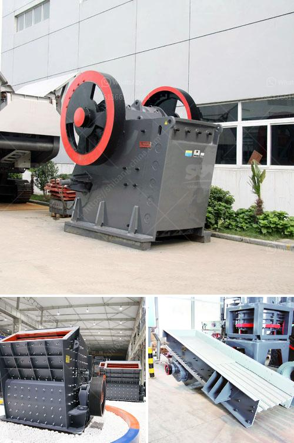

<h3>impact crusher seller</h3>
An impact crusher is a machine that uses striking as opposed to pressure to reduce the size of material. This significant process is crucial for industries such as mining and construction. The impact crusher seller plays an essential role in supplying these machines to customers.

One of the key factors to consider when choosing an impact crusher seller is their reputation. A reputable seller will have a track record of supplying high-quality machines that meet customers' needs and expectations. They will have positive reviews from satisfied clients, demonstrating their commitment to customer satisfaction.

Another important aspect to look for in an impact crusher seller is their expertise. They should have a thorough understanding of the machines they sell, including their specifications, features, and applications. This knowledge will enable them to provide accurate information and recommendations to customers. Additionally, an experienced seller will be able to handle any queries or concerns effectively, ensuring a smooth sales process.

The availability of spare parts is another crucial aspect to consider when choosing an impact crusher seller. These machines can experience wear and tear, and having access to spare parts is essential for ensuring continuous operations. A reliable seller will have a ready supply of spare parts, ensuring that customers can maintain their machines without any disruptions.

Furthermore, a good impact crusher seller will offer aftersales support and service. They will provide assistance with installation, maintenance, and repairs, ensuring that customers can maximize the lifespan of their machines. This level of support is invaluable, as it allows customers to resolve any issues promptly and minimize downtime.

In conclusion, the impact crusher seller plays a vital role in providing customers with the machines they need for efficient material reduction. When choosing a seller, it is crucial to consider their reputation, expertise, spare part availability, and aftersales support. By selecting a reliable and knowledgeable seller, customers can be confident in their purchase and the long-term success of their business operations.
<h3>Contact us</h3><ul><li><strong>Whatsapp:&nbsp;<a href="https://wa.me/8613661969651">+8613661969651</a></strong></li><li><a href="https://swt.shibang-china.com/?git&amp;zhl&amp;impact crusher seller"><strong>Online Service(chat now)</strong></a></li></ul><h3>Related</h3><ul><li><a href='process of preparation of coal and asha.md'>process of preparation of coal and asha</a></li><li><a href='limestone manufacturer supplier egypt.md'>limestone manufacturer supplier egypt</a></li><li><a href='jaw crusher vs cone crusher.md'>jaw crusher vs cone crusher</a></li><li><a href='jaw bone crusher made in britain.md'>jaw bone crusher made in britain</a></li><li><a href='transmission for ball mill.md'>transmission for ball mill</a></li></ul>