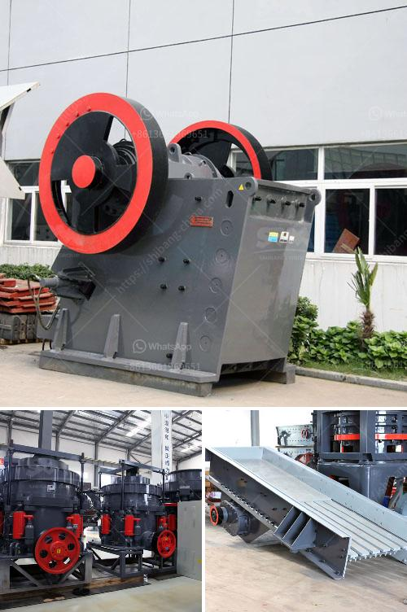

<h3>impact crushers supply</h3>
In the construction and mining industries, rock and stone materials are widely used for various purposes. As a result, the demand for crushing equipment such as impact crushers has grown rapidly over the years. Impact crushers utilize a powerful impact force to pulverize materials, resulting in a high reduction ratio and excellent cubical-shaped particles.

To meet the growing demand, manufacturers have been focusing on developing innovative crushers that can significantly enhance productivity without compromising on quality. These advancements have led to the introduction of impact crushers that offer improved efficiency, increased capacity, and reduced operating costs for users.

One of the key advantages of impact crushers is their ability to handle a wide range of materials. They can be used to crush everything from hard and abrasive rocks to soft, non-abrasive materials such as limestone, phosphate, gypsum, weathered shales, and more. This versatility makes them highly sought after in industries such as aggregates, mining, construction, and recycling.

Another significant benefit is the adjustable control of the final product size. Impact crushers can be equipped with adjustable outlet settings, allowing users to precisely control the size of the final product. This flexibility is crucial in meeting specific requirements for different applications, such as road construction, concrete production, and railway ballast.

Furthermore, impact crushers are designed for ease of maintenance and operation. Many models feature hydraulic systems that enable quick and easy rotor gap adjustments, as well as overload protection mechanisms. These features not only improve operational efficiency but also reduce downtime, ultimately contributing to higher overall productivity.

As the demand for quality aggregates and mineral products continues to rise, impact crushers play a crucial role in meeting these needs. Their ability to produce cubical-shaped particles, customizable product sizing, and easy maintenance make them indispensable in the construction and mining industries. Manufacturers continue to invest in research and development to further improve the performance and capabilities of impact crushers, ensuring a steady supply for the industry's growing demands.
<h3>Contact us</h3><ul><li><strong>Whatsapp:&nbsp;<a href="https://wa.me/8613661969651">+8613661969651</a></strong></li><li><a href="https://swt.shibang-china.com/?git&amp;zhl&amp;impact crushers supply"><strong>Online Service(chat now)</strong></a></li></ul><h3>Related</h3><ul><li><a href='mobile fine jaw crusher at saudi arabia.md'>mobile fine jaw crusher at saudi arabia</a></li><li><a href='stone crushing machine in dubai.md'>stone crushing machine in dubai</a></li><li><a href='nigeria stone grinder mill.md'>nigeria stone grinder mill</a></li><li><a href='micro mill grinding mills.md'>micro mill grinding mills</a></li><li><a href='flow sheet diagram for ceramic industry.md'>flow sheet diagram for ceramic industry</a></li></ul>