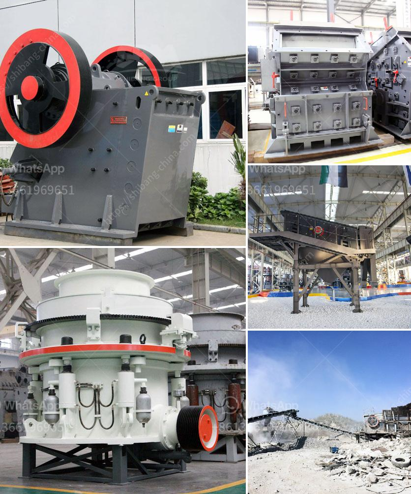

<h3>impact hammer crusher</h3>
The impact hammer crusher is a highly efficient crushing machine that can crush materials with a maximum particle size of 600-1800 mm to below 25 mm or even smaller. Hammer crushers have two ways of crushing the dry way and the wet way. It can be divided into tabular type and flowing type according to different extracting way of mine. Hammer crusher is widely used in cement industry, mining industry, building material, chemical industry etc.

To be more specific, the hammer crusher is widely used in powder-making production line including cement, new-type building material, silicate, refractory material, fertilizer, ore dressing of ferrous metal and non-ferrous metal, glass ceramics, etc. Spring Cone Crusher is used in fine crushing of all kinds of ores ,such as iron ore, Non-ferrous metal ,basalt, granite, limestone, sand rock and grail under 350Mpa crushing pressure. It is widely used in ore, cement, sand industries etc . Working Principle Of Impact Crusher: The materials are crushed via impact energy produced in the impact crusher. When the materials enter the zone of the board hammer, they are flung into the impact equipment via the high speed impact of the board hammer. These materials will be re-crushed after rebounding into the scale board. The large materials are crushed into small pieces until it becomes the specified granularities. The end products come out from the base of the impact crusher.

Various measures should be taken to extend the service life of the impact crusher. The following are some common measures for users to extend the service life of the impact crusher.

1. Users should regularly check the wear condition of the impeller, including the wear of the impeller body and the liner. If there is excessive wear or cracks, it should be replaced in time.

2. When the rotor of the impact crusher vibrates abnormally, the reason may be that the plate hammer is loose or the hammer handle is broken. Users can check the rotor by opening the rear cover.

3. After a period of operation, it is necessary to open the observation door on the back of the impeller to check the wear condition of the impeller. If it is found that the impeller is worn, it should be replaced in time to avoid further impact on the material crushing effect.

4. Pay attention to the lubrication work of the impact crusher. The friction between the spindle and the bearing is relatively large, and proper lubrication can effectively reduce the wear of the components.

In summary, the impact hammer crusher is a highly efficient crushing machine which combines the advantages of both hammer crusher and impact crusher. It can crush materials with high moisture content, which is not suitable for crusher with sieve plate continuously, and can also produce qualified material products with low energy consumption and high efficiency. With the continuous development of mining machinery industry, impact crusher has the advantages of large crushing ratio, high crushing efficiency and good particle shape, which deeply brings benefits to enterprises.
<h3>Contact us</h3><ul><li><strong>Whatsapp:&nbsp;<a href="https://wa.me/8613661969651">+8613661969651</a></strong></li><li><a href="https://swt.shibang-china.com/?git&amp;zhl&amp;impact hammer crusher"><strong>Online Service(chat now)</strong></a></li></ul><h3>Related</h3><ul><li><a href='jaw and cone crusher suppliers in mokopane.md'>jaw and cone crusher suppliers in mokopane</a></li><li><a href='allis chalmers 54 x 74 gyratory crusher.md'>allis chalmers 54 x 74 gyratory crusher</a></li><li><a href='mobile fine jaw crusher at saudi arabia.md'>mobile fine jaw crusher at saudi arabia</a></li><li><a href='sample busines project proposal for stone crusher.md'>sample busines project proposal for stone crusher</a></li><li><a href='process of preparation of coal and asha.md'>process of preparation of coal and asha</a></li></ul>