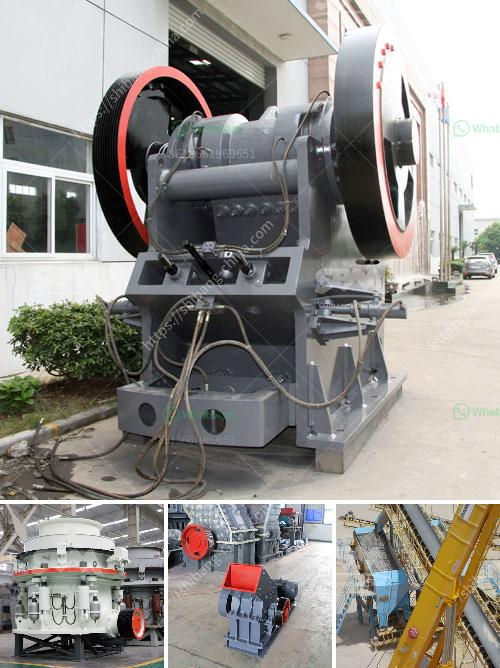

<h3>impact jaw crusher</h3>
The jaw crusher is a commonly utilized equipment which has the ability to quickly and effectively crush materials. It has revolutionized the construction, mining, and metallurgical industries, as well as other fields that involve crushing materials. The impact jaw crusher is a specially designed heavy-duty machine specially used for the crushing of hard and highly abrasive materials.

The impact jaw crusher is equipped with an advanced hydraulic system that enables the user to adjust the CSS (closed side setting) quickly and easily. This is particularly important when processing different types of materials, as it allows for precise control over the size of the final product. With this feature, the impact jaw crusher can produce a wide range of output sizes, meeting the requirements of various applications.

Another advantage of the impact jaw crusher is its high efficiency. The unique design of the crushing chamber and the powerful rotor allow for efficient crushing, resulting in a high reduction ratio. This means that the impact jaw crusher can quickly and effectively reduce the size of large materials into smaller particles, which can then be used or further processed.

In addition to its efficiency, the impact jaw crusher is also known for its durability and low maintenance requirements. It is built with robust materials and components that can withstand the harshest operating conditions. This reduces the risk of downtime and expensive repairs, making it a cost-effective option in the long run.

Overall, the impact jaw crusher is a versatile and powerful machine that offers numerous benefits for various industries. Its ability to quickly and efficiently crush materials, combined with its durability and low maintenance requirements, make it an excellent choice for any crushing application. Whether it is for construction, mining, or metallurgical purposes, the impact jaw crusher delivers reliable performance and consistent results.
<h3>Contact us</h3><ul><li><strong>Whatsapp:&nbsp;<a href="https://wa.me/8613661969651">+8613661969651</a></strong></li><li><a href="https://swt.shibang-china.com/?git&amp;zhl&amp;impact jaw crusher"><strong>Online Service(chat now)</strong></a></li></ul><h3>Related</h3><ul><li><a href='jaw crusher in south africa.md'>jaw crusher in south africa</a></li><li><a href='rock quarry crusher equipment.md'>rock quarry crusher equipment</a></li><li><a href='nepal crushing crusher.md'>nepal crushing crusher</a></li><li><a href='toner production line suppliers.md'>toner production line suppliers</a></li><li><a href='conveyor belts kenya.md'>conveyor belts kenya</a></li></ul>