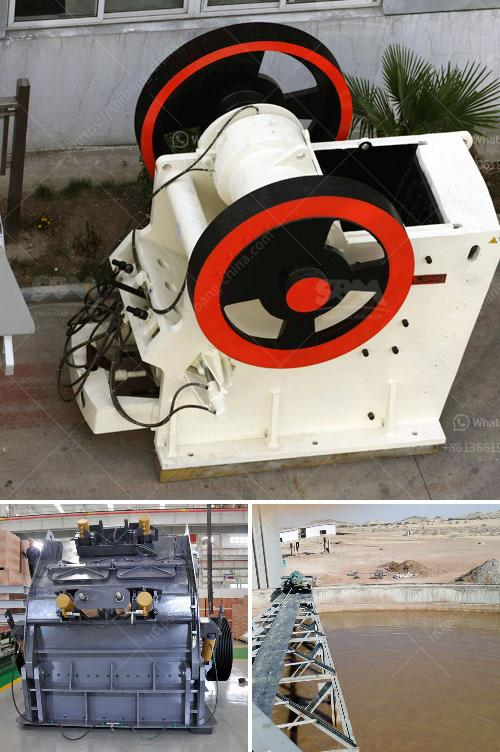

<h3>india herzog pulverizer hp m 100 p venta</h3>
India, a country known for its rich cultural heritage, has always been at the forefront of technological advancements. In recent years, there has been a significant rise in the demand for various pulverizing machines, particularly in industries such as mining, construction, and agriculture. One name that shines bright in this market is the India Herzog Pulverizer HP-M 100 P Venta.

The Herzog Pulverizer HP-M 100 P Venta is a cutting-edge machine that has revolutionized the pulverizing industry in India. With its advanced features and unparalleled performance, it has become the go-to choice for many businesses in need of efficient and reliable pulverizing solutions.

One of the key features that sets the Herzog Pulverizer HP-M 100 P Venta apart from its competitors is its high precision and accuracy. The machine is equipped with a powerful motor and a state-of-the-art control system, which ensures that the pulverizing process is carried out with utmost precision. This level of accuracy is essential in industries such as mining, where even the smallest error can lead to significant losses.

Moreover, the HP-M 100 P Venta offers a wide range of pulverizing options, making it suitable for a variety of applications. Whether it is coal, minerals, or rocks, this machine can pulverize them all with ease. This versatility has made it a favorite among industries that deal with different materials on a regular basis.

The efficiency of the Herzog Pulverizer HP-M 100 P Venta is another aspect that makes it stand out. With its high-speed rotation and durable construction, this machine can process a large volume of material in a short amount of time. This results in increased productivity and reduced downtime for businesses that rely on pulverizing machines for their operations.

Furthermore, the HP-M 100 P Venta is designed to be user-friendly, with a simple and intuitive interface. This ensures that operators can quickly familiarize themselves with the machine, reducing the need for extensive training. As a result, businesses can save both time and money, as they can start using the pulverizer immediately after its installation.

In addition to its exceptional performance, the Herzog Pulverizer HP-M 100 P Venta is also known for its durability and longevity. Built with high-quality materials, it can withstand harsh operating conditions and heavy-duty usage without compromising its efficiency. This means that businesses investing in this machine can expect a long lifespan and minimal maintenance requirements.

India Herzog, the manufacturer of the HP-M 100 P Venta, is renowned for its commitment to customer satisfaction. They provide excellent after-sales support, ensuring that businesses can rely on their machines for years to come. Their dedicated team of experts is always ready to address any concerns or queries, offering prompt solutions and technical assistance.

In conclusion, the India Herzog Pulverizer HP-M 100 P Venta is a game-changer in the pulverizing industry in India. Its advanced features, precision, versatility, efficiency, user-friendliness, and durability make it the ideal choice for businesses in need of top-notch pulverizing solutions. With India Herzog's commitment to customer satisfaction, investing in the HP-M 100 P Venta is a decision that businesses can make with confidence, knowing that they are getting a reliable and efficient pulverizing machine.
<h3>Contact us</h3><ul><li><strong>Whatsapp:&nbsp;<a href="https://wa.me/8613661969651">+8613661969651</a></strong></li><li><a href="https://swt.shibang-china.com/?git&amp;zhl&amp;india herzog pulverizer hp m 100 p venta"><strong>Online Service(chat now)</strong></a></li></ul><h3>Related</h3><ul><li><a href='design drawings of a hammer mill.md'>design drawings of a hammer mill</a></li><li><a href='stone crusher price in zambia.md'>stone crusher price in zambia</a></li><li><a href='buy impact crushers.md'>buy impact crushers</a></li><li><a href='china coal mill grinder manufacturers china.md'>china coal mill grinder manufacturers china</a></li><li><a href='sayaji stone crusher machine.md'>sayaji stone crusher machine</a></li></ul>