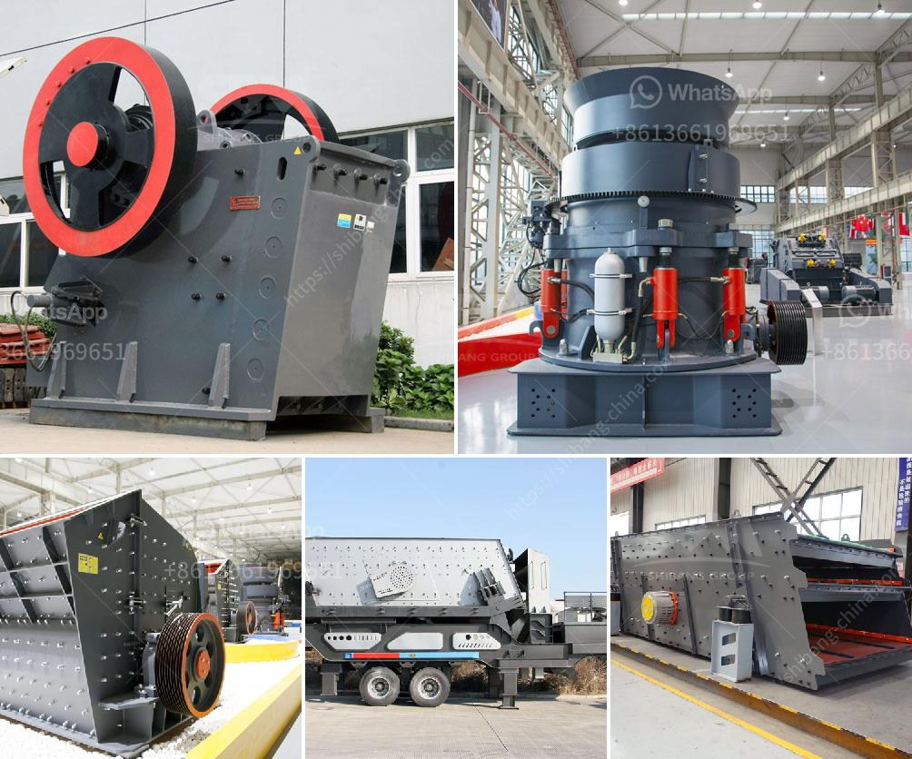

<h3>india quartz powder manufacture</h3>
Quartz powder, commonly known as silica powder, is a key ingredient used in various industries such as glass manufacturing, ceramics, electronics, and construction. India has emerged as a major player in the global quartz powder market, catering to both domestic and international demand. This article delves into the process of quartz powder manufacture in India and highlights its significance in the industry.

India's rich reserves of quartz make it a favorable location for quartz powder production. The extraction of quartz begins with mining operations, where quartz deposits are carefully excavated. These mines are spread across different states in India, with Rajasthan, Andhra Pradesh, and Telangana being major contributors to the country's quartz output.

Once the raw quartz is extracted, it undergoes several processing steps to transform it into high-quality quartz powder. The first step involves crushing the raw quartz pieces into smaller sizes using specialized machinery. This crushed quartz is then further processed through techniques like grinding and pulverizing to obtain fine particles of consistent size. The final product is the quartz powder, which is carefully packaged and stored for transportation.

One of the key advantages of Indian quartz powder manufacture is the abundance of high-quality raw materials. Indian mines produce quartz with exceptional purity and consistency, making it suitable for a wide range of applications. The superior raw material quality ensures that the manufactured quartz powder meets the stringent requirements of various industries, giving India a competitive edge in the global market.

The quartz powder manufactured in India finds extensive usage across numerous sectors. In the glass industry, quartz powder is used to produce high-quality glassware, bottles, and optical fibers. Its excellent heat resistance and electrical properties make it an ideal component for manufacturing semiconductors, electronics, and solar panels. Quartz powder is also an essential ingredient in ceramic and porcelain production, enhancing the strength and durability of the final product. Additionally, the construction industry extensively utilizes quartz powder in the production of concrete and various building materials.

India's quartz powder manufacture has earned a prominent place in the global market due to various factors. The country's well-established infrastructure, including transportation and logistics networks, enables efficient and timely delivery of the product to international buyers. Moreover, the cost-effectiveness of Indian quartz powder production has made it an attractive choice for global customers, resulting in increased export volumes.

To meet the growing demand for quartz powder, manufacturers in India are continuously investing in advanced machinery and technologies. These investments have resulted in improved production capacities, higher efficiency, and consistent product quality. Furthermore, manufacturers are increasingly adopting sustainable practices, focusing on energy efficiency and waste reduction, to minimize the environmental impact of the production process.

In conclusion, India has emerged as a leading player in the quartz powder manufacture, catering to diverse industries worldwide. The country's rich quartz reserves, superior raw material quality, and cost-effectiveness have contributed to its success in the global market. With ongoing investments in infrastructure and sustainable practices, India's quartz powder industry is set to maintain its strong position and continue meeting the evolving needs of global customers.
<h3>Contact us</h3><ul><li><strong>Whatsapp:&nbsp;<a href="https://wa.me/8613661969651">+8613661969651</a></strong></li><li><a href="https://swt.shibang-china.com/?git&amp;zhl&amp;india quartz powder manufacture"><strong>Online Service(chat now)</strong></a></li></ul><h3>Related</h3><ul><li><a href='500 tph stone crusher price.md'>500 tph stone crusher price</a></li><li><a href='stone crusher plant layout.md'>stone crusher plant layout</a></li><li><a href='ball mills in monterrey.md'>ball mills in monterrey</a></li><li><a href='price pe 600 and 900 stone crusher.md'>price pe 600 and 900 stone crusher</a></li><li><a href='working of ball mill in hindi.md'>working of ball mill in hindi</a></li></ul>