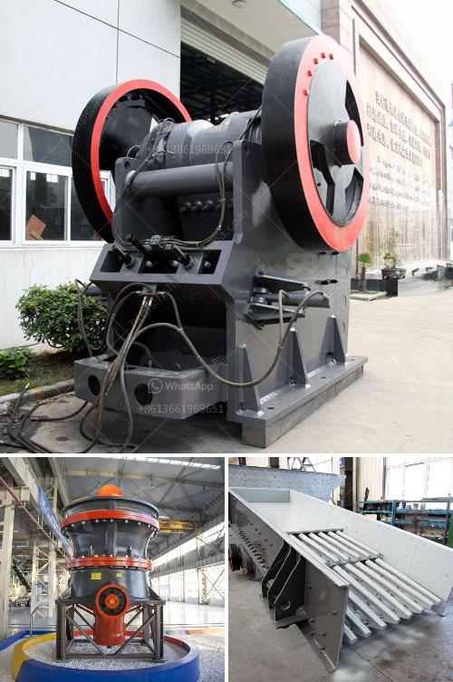

<h3>industrial crushing machines</h3>
Industrial crushing machines are essential equipment in a wide range of industries, including mining, pharmaceuticals, food processing, construction, and recycling. These machines are used to break down large materials into smaller, more manageable pieces, allowing for easier processing, handling, and transportation.

One of the primary purposes of industrial crushing machines is to reduce the size of raw materials for further processing. For example, in mining operations, crushers are used to break down ore into smaller pieces that are then processed to extract valuable minerals. Similarly, in food processing plants, crushers are employed to break down large food items into smaller particles for further cooking, grinding, or packaging.

The process of crushing involves applying mechanical force to break down materials. Industrial crushing machines typically use a combination of impact, compression, and shearing forces to achieve this. The choice of the machine and method of crushing depend on the type of material being processed, its hardness, and the desired output size.

There are several types of industrial crushing machines available, each designed for specific applications. Jaw crushers are commonly used in mining and construction industries to crush large rocks and stones. They are ideal for primary crushing of materials such as granite, limestone, and concrete.

Impact crushers, on the other hand, are used for secondary crushing operations. They are commonly used to crush medium-hard materials such as limestone and dolomite, as well as soft materials like coal and limestone. Impact crushers work by throwing the material against a hard surface, causing it to break and disintegrate into smaller pieces.

Cone crushers are popular in the mining and aggregate industries for their ability to crush hard and abrasive materials. They work by compressing the material between a rotating mantle and a stationary chamber. Cone crushers are ideal for producing high-quality end products with a uniform shape and size.

In addition to these primary crushing machines, there are also specialized crushers designed for specific applications. For example, roll crushers are used in the mining industry to crush coal and metal ore, while hammer mills are used in agriculture and food processing to crush grain and other agricultural products.

The benefits of using industrial crushing machines are numerous. Firstly, they increase productivity by reducing the time and effort required to process large materials. Secondly, they improve the quality and consistency of the end product by ensuring uniform size reduction. Lastly, they enhance safety by reducing the risk of human injury and the need for manual labor.

In conclusion, industrial crushing machines are essential equipment in various industries for breaking down large materials into smaller, more manageable pieces. They use a combination of forces to achieve this, including impact, compression, and shearing. The different types of machines available cater to different applications and materials. By using these machines, businesses can enhance productivity, improve the quality of their products, and ensure the safety of their workers.
<h3>Contact us</h3><ul><li><strong>Whatsapp:&nbsp;<a href="https://wa.me/8613661969651">+8613661969651</a></strong></li><li><a href="https://swt.shibang-china.com/?git&amp;zhl&amp;industrial crushing machines"><strong>Online Service(chat now)</strong></a></li></ul><h3>Related</h3><ul><li><a href='impact jaw crusher.md'>impact jaw crusher</a></li><li><a href='rock crusher machine.md'>rock crusher machine</a></li><li><a href='cornerstone equipment used rock crushers.md'>cornerstone equipment used rock crushers</a></li><li><a href='crusher plant project cost.md'>crusher plant project cost</a></li><li><a href='special electrodes for ball mill.md'>special electrodes for ball mill</a></li></ul>