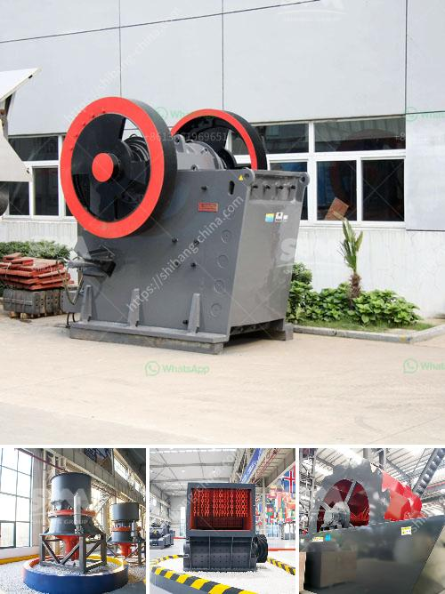

<h3>iron crusher in mexico</h3>
Mexico, a country known for its rich abundance of natural resources, is leading the way in the recycling industry. One key machine in this endeavor is the iron crusher. Made from a robust iron material, this impressive crusher is designed to reduce large chunks of iron into small and manageable particles, ensuring efficient recycling processes.

The iron crusher plays a vital role in Mexico's commitment to environmental sustainability. With the increasing demand for iron-based products across various industries, recycling has become a crucial practice. By processing scrap iron into reusable materials, the iron crusher significantly reduces the need for mining and manufacturing new iron, thus conserving valuable natural resources and reducing the environmental impact caused by extraction activities.

Moreover, the iron crusher in Mexico is not only contributing to a greener future but also promoting economic growth. Recycling industries offer job opportunities by prioritizing the sorting and processing of reusable materials. Consequently, the iron crusher's presence in Mexico is helping to create a framework for a sustainable and prosperous future.

The functionality of the iron crusher is another reason for its growing popularity. Its powerful crushing mechanism can handle a significant volume of iron waste, converting it into smaller particles ready for recycling without compromising efficiency or quality. Furthermore, the machine's durable iron construction ensures longevity, making it a cost-effective investment for recycling companies.

The iron crusher in Mexico represents a milestone in the country's pursuit of a circular economy, where resources are utilized and recycled in a closed-loop system. While the immediate benefits of recycling are evident, the long-term impact of this practice is immeasurable. By effectively reducing waste, the iron crusher is fostering a cleaner and healthier environment, providing a solid foundation for future generations.

As Mexico continues to embrace sustainable practices, the iron crusher will remain an essential component of the recycling industry. With its numerous advantages, it will play an instrumental role in shaping a more environmentally conscious and prosperous future for the country.
<h3>Contact us</h3><ul><li><strong>Whatsapp:&nbsp;<a href="https://wa.me/8613661969651">+8613661969651</a></strong></li><li><a href="https://swt.shibang-china.com/?git&amp;zhl&amp;iron crusher in mexico"><strong>Online Service(chat now)</strong></a></li></ul><h3>Related</h3><ul><li><a href='ball mill india india.md'>ball mill india india</a></li><li><a href='stone crushing machine in dubai.md'>stone crushing machine in dubai</a></li><li><a href='ultra fine grinder feeding size.md'>ultra fine grinder feeding size</a></li><li><a href='gravel screening equipment.md'>gravel screening equipment</a></li><li><a href='rock crusher plant operations manager.md'>rock crusher plant operations manager</a></li></ul>