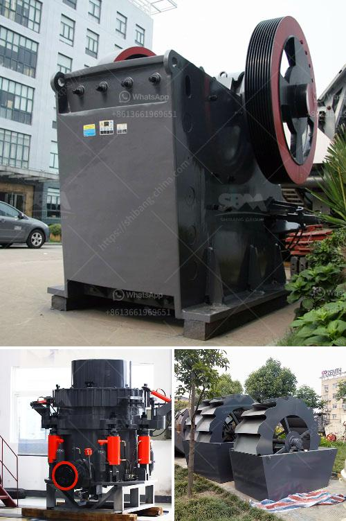

<h3>iron crusher manufacturer</h3>
Iron ore is one of the most abundant resources in the world, and iron ore crushing and grinding processes are essential in the mining industry. The iron ore crushing equipment manufactured by an expert iron ore crusher manufacturer plays an important role in the whole production process.

Iron ore crusher is a kind of iron ore ore will be broken step by step, from the chunk of iron ore (500mm or so) step by step to the millimeter-scale fine material of the mechanical equipment, usually using iron ore dry election The enrichment of the lean ore is carried out, and the enriched iron ore is subsequently treated with pellets. Similarly, the iron ore crusher produced by the iron ore crusher manufacturer can be widely used in metallurgy, mining, building materials, chemicals, railways, water conservancy and other industries.

The iron ore crusher manufacturer has rich production experience and mature production technology. It can meet the needs of different customers and provide high-quality iron ore crusher equipment. The iron ore crusher delivered by the manufacturer has excellent performance and stable operation. It is a reliable choice for the production of iron ore.

In addition, the iron ore crusher manufacturer also develops and produces efficient hydraulic cone crusher, which greatly improves the production efficiency and crushing capacity of the crusher. For iron ore, the iron ore crusher manufacturer offers more than just iron ore crushing equipment, but can also customize solutions according to the specific needs of customers.

With the continuous development of the mining industry, the demand for iron ore equipment is increasing, and the market competition is becoming more intense. In this context, choosing a reliable iron ore crusher manufacturer is crucial. A good iron ore crusher manufacturer can not only provide high-quality equipment, but also offer professional technical support, comprehensive after-sales service, and competitive price.

Overall, the iron ore crusher manufacturer not only provides high-quality equipment but also helps customers improve production efficiency, reduce production costs, and create more benefits. Choosing the right iron ore crusher manufacturer is the first step towards the success of your iron ore production line.
<h3>Contact us</h3><ul><li><strong>Whatsapp:&nbsp;<a href="https://wa.me/8613661969651">+8613661969651</a></strong></li><li><a href="https://swt.shibang-china.com/?git&amp;zhl&amp;iron crusher manufacturer"><strong>Online Service(chat now)</strong></a></li></ul><h3>Related</h3><ul><li><a href='quartz manufacturing plant.md'>quartz manufacturing plant</a></li><li><a href='concrete crushing equipment.md'>concrete crushing equipment</a></li><li><a href='calcium oxide crusher.md'>calcium oxide crusher</a></li><li><a href='toner production line suppliers.md'>toner production line suppliers</a></li><li><a href='puzzolana 200 tph cone crusher plant price.md'>puzzolana 200 tph cone crusher plant price</a></li></ul>