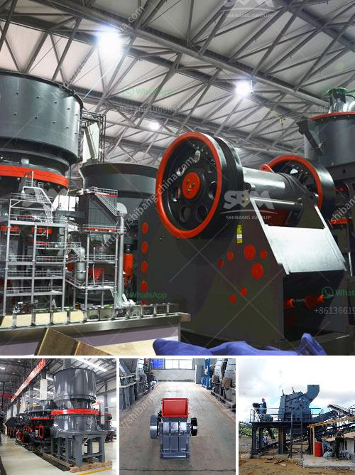

<h3>iron crushing equipment price</h3>
Iron ore is one of the main raw materials that are utilized in the production of steel and other construction materials. With the growing global demand for steel, it is beneficial for iron ore producers to invest in mining and crushing equipment to increase output and decrease operating costs.

Iron ore can be mined from open pits or underground mines. There are several types of mining equipment that will be used in these operations, including excavators, loaders, crushing plants, grinding mills, and conveyors. The selection of the right crushing equipment is influenced by factors such as ore characteristics, geographical location, logistics, and economic conditions.

Price is a key consideration in the purchasing decision for crushing equipment. However, it shouldn't be the sole determining factor. It is important for buyers to understand the overall value that the equipment can bring to their operations. A higher-priced equipment may offer better performance, increased efficiency, and longer service life, resulting in significant cost savings in the long run.

One of the primary factors that affects the price of iron crushing equipment is the type of crushing machine. There are many different types of crushing machines on the market, ranging from jaw crushers and cone crushers to impact crushers and roller crushers. Each type has its own advantages and disadvantages, and their prices vary accordingly.

For instance, jaw crushers are generally used for primary crushing due to their large crushing ratio and high production capacity. They are sturdy machines that can handle tough materials, but they tend to have a higher initial cost. On the other hand, cone crushers are commonly used for secondary and tertiary crushing, offering finer reduction and better shape of the final product. Their prices can vary depending on the sizes and specifications.

In addition to the type of machine, other factors that influence the price include the brand, production capacity, technical level, and after-sales service. Well-known brands with a strong reputation generally come with a higher price tag. However, they often offer better quality, reliability, and customer support, ensuring minimal downtime and smoother operations in the long term.

Furthermore, the production capacity of the crushing equipment should align with the expected output of the mining operation. Investing in a machine with a lower production capacity may result in inefficiencies and delays, while purchasing an overly large machine could lead to unnecessary costs.

Lastly, the technical level of the equipment and the after-sales service provided by the manufacturer are crucial. Advanced technologies can improve the efficiency and performance of the equipment, leading to higher productivity and lower operational costs. Additionally, reliable after-sales service ensures prompt maintenance and spare parts availability, minimizing downtime and maximizing productivity.

When considering the price of iron crushing equipment, buyers should look beyond just the initial cost. It is essential to consider factors such as the type of machine, brand reputation, production capacity, technical level, and after-sales service. By making an informed decision, buyers can invest in the right equipment that will optimize their iron ore crushing operations and provide a solid return on investment.
<h3>Contact us</h3><ul><li><strong>Whatsapp:&nbsp;<a href="https://wa.me/8613661969651">+8613661969651</a></strong></li><li><a href="https://swt.shibang-china.com/?git&amp;zhl&amp;iron crushing equipment price"><strong>Online Service(chat now)</strong></a></li></ul><h3>Related</h3><ul><li><a href='alluvial mobile diamond processing plant.md'>alluvial mobile diamond processing plant</a></li><li><a href='ore beneficiation equipment suppliers china.md'>ore beneficiation equipment suppliers china</a></li><li><a href='project cost of a cement plant.md'>project cost of a cement plant</a></li><li><a href='copper mining process.md'>copper mining process</a></li><li><a href='crusher stone sand making stone quarry.md'>crusher stone sand making stone quarry</a></li></ul>