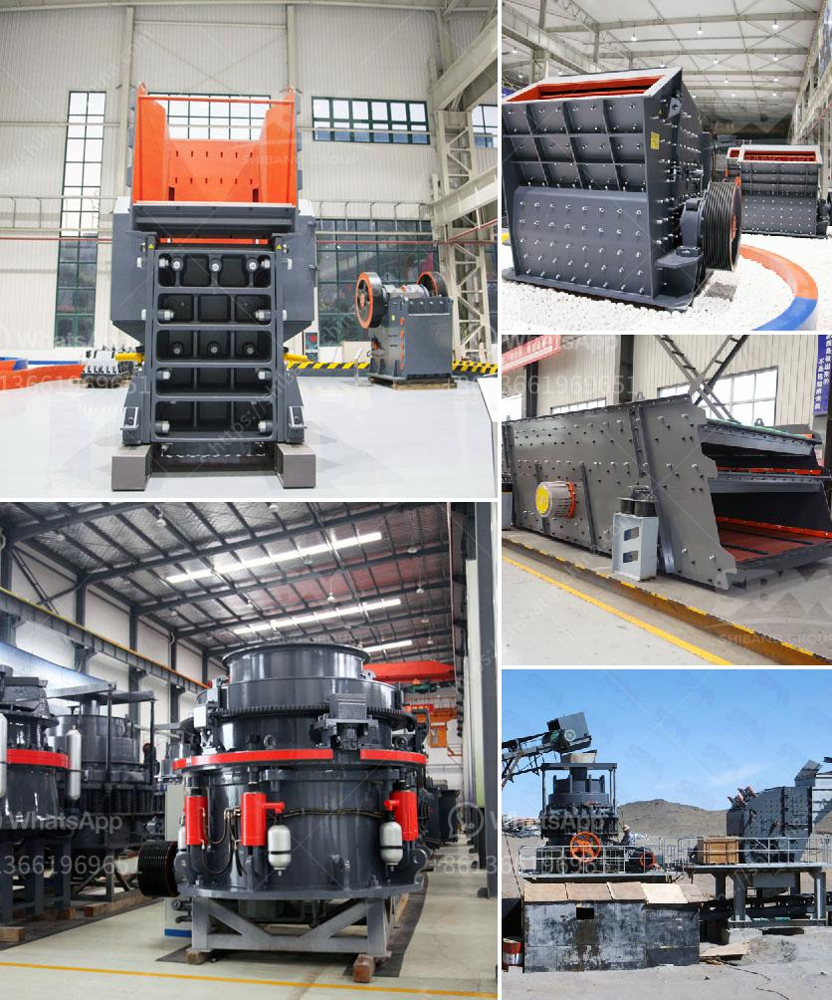

<h3>iron crushing machine for sale</h3>
Looking for a high-quality and efficient iron crushing machine? Well, look no further as we have the perfect solution for you. Iron ore is an important raw material for many industries, and copper ore, silver ore, tin ore, and gold ore are the most common ores that our crushing machine can deal with. With the rapid development of the mining industry, the demand for iron crushing machines is increasing, making it a hot choice for investors across various sectors.

One of the main advantages of our iron crushing machine is its high efficiency. Equipped with advanced crushing technology, it can crush materials with high hardness and large size effectively. This enhances the production capacity and reduces the energy consumption, providing more value for your investment. Additionally, our machine is designed with durable and wear-resistant materials to ensure long-lasting performance, minimizing maintenance and downtime.

Another significant aspect of our iron crushing machine is its versatility. It is not only suitable for crushing various ores but also capable of processing different sizes of iron materials. Whether you need coarse, medium, or fine crushing, our machine can meet your specific requirements. This flexibility allows you to adapt to changing market demands and optimize your production process.

Furthermore, our iron crushing machine is designed with safety and ease of use in mind. The machine features a user-friendly control panel that allows operators to easily adjust the settings based on the desired output size. It also incorporates advanced safety features, such as an automatic overload protection system and a hydraulic release mechanism, which protects the machine from damage and ensures the safety of the operator.

In addition to the excellent performance and user-friendly design, our iron crushing machine is available for sale at a competitive price. We understand that cost-effectiveness is crucial for businesses, especially in today's competitive market. That's why we strive to provide affordable machinery without compromising on quality. Our machines are manufactured using high-grade materials and are extensively tested to meet international quality standards, ensuring reliability and durability.

When investing in an iron crushing machine, it is essential to consider after-sales service and support. We take pride in our commitment to customer satisfaction and offer comprehensive after-sales services. Our team of experienced technicians is readily available to provide assistance, including installation, maintenance, and troubleshooting. With our reliable support, you can have peace of mind knowing that your investment is in good hands.

In conclusion, if you are looking for an iron crushing machine for sale, our efficient and cost-effective machinery is the perfect solution for you. With its high crushing capacity, versatility, safety features, and competitive pricing, our machine offers exceptional value for your investment. Furthermore, our commitment to customer satisfaction ensures that you receive reliable after-sales support, making your buying experience hassle-free. So don't miss out on this opportunity to enhance your production capabilities and stay ahead in the competitive mining industry.
<h3>Contact us</h3><ul><li><strong>Whatsapp:&nbsp;<a href="https://wa.me/8613661969651">+8613661969651</a></strong></li><li><a href="https://swt.shibang-china.com/?git&amp;zhl&amp;iron crushing machine for sale"><strong>Online Service(chat now)</strong></a></li></ul><h3>Related</h3><ul><li><a href='mineral grinding raymond.md'>mineral grinding raymond</a></li><li><a href='grinding balls in tanzania.md'>grinding balls in tanzania</a></li><li><a href='crusher hammer material grade.md'>crusher hammer material grade</a></li><li><a href='impact crusher dealer.md'>impact crusher dealer</a></li><li><a href='ball mill grinding manufacturer in india.md'>ball mill grinding manufacturer in india</a></li></ul>