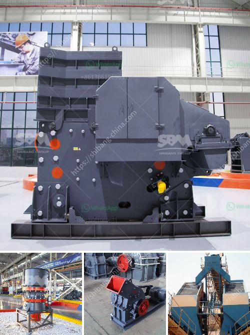

<h3>iron ore beneficiation process in mexico</h3>
Iron ore beneficiation is a multi-stage process that raw iron ore undergoes to purify it prior to the process of smelting, which involves melting the ore to remove the metal content. The process of iron ore beneficiation has two complementary goals and these define the methods used to refine it. The iron content of the ore needs to be increased and gangue, which is native rock and minerals of lesser value within the ore itself, must be separated out.

One of Mexico's most important mining industries is iron ore, which has played a crucial role in the country's economic development. At present, Mexico ranks thirteenth in global production. It produces 80 million tons of iron ore annually, which represents a value of around $1.5 billion.

The process of iron ore beneficiation involves crushing, grinding, magnetic separation, gravity separation and flotation. During the crushing process, the iron ore is ground into fine particles through ball mill. After that, the iron ore powder is mixed with water and flotation reagents to eliminate impurities. Magnetic separation is the next step in the process. After further separation, the concentrate powder with high grade is obtained and the tailings are discarded. Finally, the concentrate is transported to the smelting plant, where it is used to produce steel.

Mexico primarily exports its iron ore to China, one of the world's largest iron ore consumers. The Mexican iron ore is mainly utilized by Chinese steel manufacturers to produce steel products for both domestic and export markets. Hence, the beneficiation process determines the efficiency and the quality of the final product, and thus plays a vital role in minimizing environmental impacts associated with mining activities.

Efforts have been made to utilize the iron ore beneficiation process for economic and environmental sustainability. For instance, new technologies have been developed to improve magnetic separation techniques, allowing for higher recovery rates of iron ore concentrate. This has led to increased efficiency in the beneficiation process and improved environmental performance.

One of the key challenges faced by Mexico's iron ore beneficiation industry is the low iron ore prices in the international market. This has led to decreased profitability for mining companies, making it difficult for them to continue operations. The Mexican government has been actively supporting the industry through various measures, such as promoting investment in infrastructure and providing tax incentives to attract foreign investors.

In conclusion, the iron ore beneficiation process is a complex process that involves many techniques to upgrade the iron content and eliminate impurities. Mexico's iron ore industry plays a vital role in its economic development, contributing significantly to its GDP and employment opportunities. Efforts are continually being made to improve the beneficiation process for economic and environmental sustainability. However, challenges remain, such as fluctuating iron ore prices, which impact the profitability of mining companies. Nonetheless, the Mexican government's support and investment in the industry reflect its commitment to the sector's growth and development.
<h3>Contact us</h3><ul><li><strong>Whatsapp:&nbsp;<a href="https://wa.me/8613661969651">+8613661969651</a></strong></li><li><a href="https://swt.shibang-china.com/?git&amp;zhl&amp;iron ore beneficiation process in mexico"><strong>Online Service(chat now)</strong></a></li></ul><h3>Related</h3><ul><li><a href='komatsu br 380 crusher for sale in malaysia.md'>komatsu br 380 crusher for sale in malaysia</a></li><li><a href='crusher machines for sale.md'>crusher machines for sale</a></li><li><a href='sand washing machinery.md'>sand washing machinery</a></li><li><a href='clinker production process.md'>clinker production process</a></li><li><a href='250tph comprehensive portable crushing plant.md'>250tph comprehensive portable crushing plant</a></li></ul>