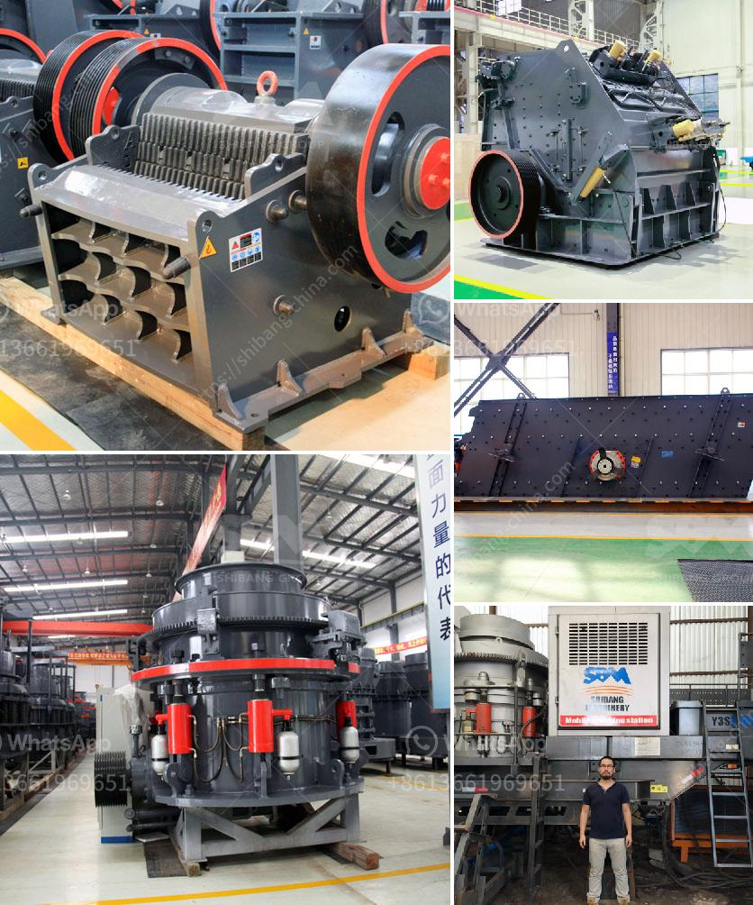

<h3>iron ore crushing plant in germany</h3>
Iron ore is widely distributed in nature and is a very important material in industrial iron and steel production enterprises. Natural ore (iron ore) is gradually selected from iron by means of crushing, grinding, magnetic separation, flotation, re-election, etc. In theory, any ore containing iron or iron compounds can be called iron ore; however, ore containing only 55%-60% iron content can be used for iron and steel industry.

Germany's largest iron ore plant is located in Holtorf, about 30 kilometers south of Hanover. The losses incurred by the long-distance transportation of raw ores have swallowed up all the profits of the iron ores in Germany for a long time. Germany is rich in iron ore resources, but the average grade of iron ore is not high. Only about 30% of the iron ore deposits at home and abroad contain more than 60% iron. Therefore, the establishment of an iron ore crushing plant would be a key development priority.

The requirements for ore mining are increasing as the market demand for steel increases. Germany has a rich amount of iron ore reserves that can satisfy the demand for many years ahead. Germany has positioned itself as a high-tech country and its design and construction standards are known for their precision and exceptional quality. Therefore, Germany has the potential to become the world's leading iron ore crushing plant exporter.

The reason for this is that Germany is the largest economy in Europe and one of the largest manufacturing countries in the world. Its industrial development level is ahead of other European countries. The establishment of an iron ore crushing plant would bring many benefits to Germany. Besides, there are many other countries with large iron ore deposits such as China, Australia, Brazil, India, Russia, Ukraine, Canada, South Africa, etc.

Iron ore crushing plant should be as efficient and simple, in the concentrator, the crushing and grinding operations of investment equipment, production costs, power consumption and steel consumption is often the largest proportion, so the calculation of crushing and grinding equipment selection and operations management is good or bad, to a large extent determines the economic benefits of the concentrator.

In order to ensure the crushing capacity and quality of finished ballasts, Great Wall Company install three crushing stage for ballast crushing plant. Primary crusher is PE 500 x750 jaw crusher in coarse crushing process, PYB900 spring cone crusher is used in the medium crushing process and PF 1007 impact crusher is tertiary crushing device for reshaping ballasts in fine crushing process.Stone jaw crusher and cone crusher greatly reduce the abrasion of impact crusher in complete ballasts crushing and screening plant. The customized equipment list of cone crusher is in the following.

Studies have shown that the pulverization of ballast to obtain sufficiently small particles promotes metal recovery and avoids the unnecessary mining of higher grade ores, which reduces the mineable reserves.

It is clear that the crushing process greatly contributes to the reuse of valuable metal remnants. Additionally, the crushing of ballasts provides better resource utilization and saves energy and resources in subsequent processing and refining stages.

In conclusion, the iron ore crushing plant in Germany plays an important role in the recovery of valuable minerals from natural ores. With the development of technology and economy, Germany should further optimize the production layout and environmental protection focus on the recycling of valuable resources.
<h3>Contact us</h3><ul><li><strong>Whatsapp:&nbsp;<a href="https://wa.me/8613661969651">+8613661969651</a></strong></li><li><a href="https://swt.shibang-china.com/?git&amp;zhl&amp;iron ore crushing plant in germany"><strong>Online Service(chat now)</strong></a></li></ul><h3>Related</h3><ul><li><a href='price of large jaw crusher.md'>price of large jaw crusher</a></li><li><a href='basalt rock crusher suppliers in dubai.md'>basalt rock crusher suppliers in dubai</a></li><li><a href='rock crusher cone.md'>rock crusher cone</a></li><li><a href='second hand mobile crushers and screens south africa.md'>second hand mobile crushers and screens south africa</a></li><li><a href='mini stone crushing machine.md'>mini stone crushing machine</a></li></ul>