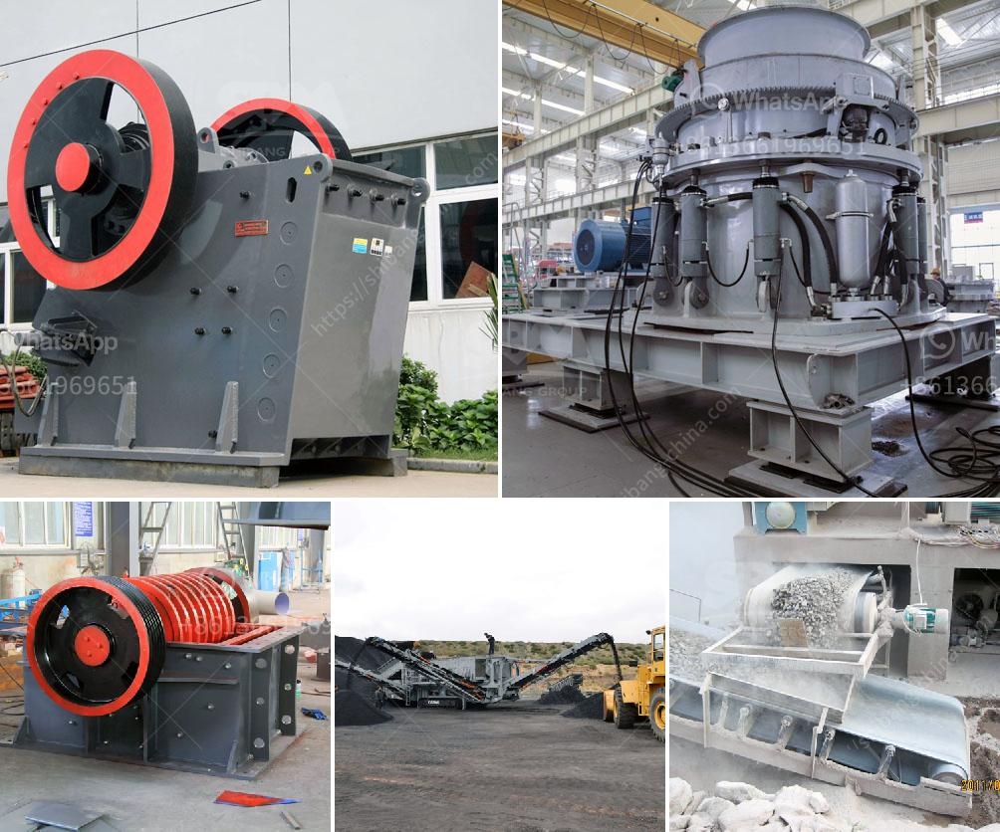

<h3>iron ore crushing</h3>
Iron ore crushing process plays an essential role in steel producing industry and it is the first step to produce iron ore and to resize iron ores into the sand size particles. The iron ore crushing process goes as follows: vibrating feeder→ jaw crusher → belt conveyor →cone crusher → circular vibrating screen. Big iron ore materials are fed into the jaw crusher evenly and gradually by vibrating feeder through a hopper for primary crushing. After first crushing process, the materials will be transferred to the cone crusher by belt conveyor for secondary crushing.

Iron ore crushing process essentially aims to break the massive raw ores into small particles, which will facilitate the next step of separating minerals from the ore. In the crushing process, large chunks of iron ore are sent to the jaw crusher for primary crushing. After being crushed to reasonable size, the iron ore is then crushed into fine particles by cone crusher.

The process of crushing iron ore is quite important for the whole cement production line. Iron ore crusher can take many different forms, depending on the different elements of the ore. While iron ore cone crusher has high capacity and good quality, it has been widely used in iron ore crushing production. The crusher is suitable for medium and fine crushing of various ores and rocks, especially in iron ore, non-ferrous metal ore, granite, limestone, quartzite, sandstone and other hard and brittle materials in the crushing process.

Iron ore crushing is a very important step in iron ore crushing process, it is suitable to crush the ores which contain magnetite, hematite, limonite, siderite, pyrite, blue iron ore, etc. These minerals are mostly used as raw materials for the production of steel. Raw iron ores are crushed by jaw crusher, then get a reasonable degree of fineness iron ore. These relatively small iron ore particles enter ball mill for grinding through the elevator and vibrating feeder. After ball mill grinding, the milled ore gets the next procedure: classification. As different proportion of solid particles in the liquid precipitation at different speeds of the principle, so we can make use of flotation machine to get iron ore concentrates. Otherwise, in modern iron ore mining industry, making use of magnetic separation is the most widely used method.

In conclusion, iron ore crushing process plays an important role in steel producing industry and it is the first step to produce iron ore and to resize iron ores into the sand size particles. With the continuous development of technology, the crushing process for iron ore will also experience continuous improvement.
<h3>Contact us</h3><ul><li><strong>Whatsapp:&nbsp;<a href="https://wa.me/8613661969651">+8613661969651</a></strong></li><li><a href="https://swt.shibang-china.com/?git&amp;zhl&amp;iron ore crushing"><strong>Online Service(chat now)</strong></a></li></ul><h3>Related</h3><ul><li><a href='india quartz powder manufacture.md'>india quartz powder manufacture</a></li><li><a href='cold roll mills in turkey.md'>cold roll mills in turkey</a></li><li><a href='cost of 100 tpd cement plant.md'>cost of 100 tpd cement plant</a></li><li><a href='mobile crushers philippines.md'>mobile crushers philippines</a></li><li><a href='harga mesin crusher batu kapasitas 300 ton per jam.md'>harga mesin crusher batu kapasitas 300 ton per jam</a></li></ul>