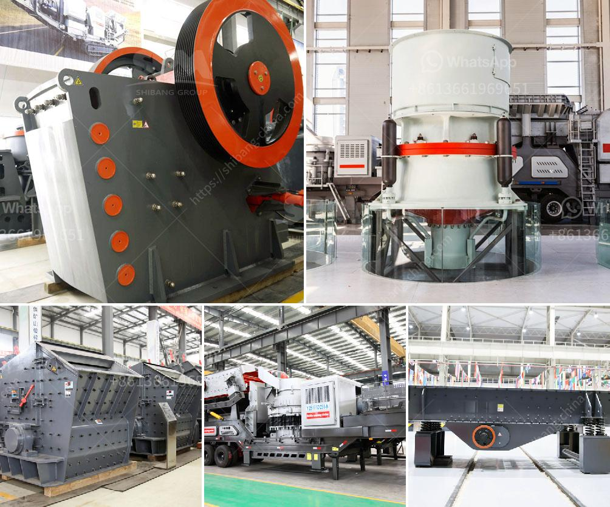

<h3>iron ore processing equipment in mexico</h3>
Iron ore is a significant mineral commodity that is widely mined and processed in Mexico and other countries across the globe. Mexico has long been an important producer of iron ore, and is one of the largest exporters of this commodity in the world. Mining and processing of iron ore involves a series of processes that vary depending on the type of deposit and the nature of the ore.

In Mexico, huge deposits of hematite and magnetite iron ore have been discovered and explored for decades. These ores typically require various levels of beneficiation, which can include crushing, grinding, magnetic separation, and flotation to produce concentrates that are suitable for further processing, such as smelting or direct reduction. Mexico's vast iron ore reserves and its diversified range of processing techniques make it a globally significant player in the iron ore industry.

1. Crushing and screening: The first step in processing iron ore involves crushing the large pieces of ore into smaller sizes. This is usually done using jaw crushers or cone crushers. The crushed ore is then screened to separate the standard-sized particles from the oversized ones.

2. Grinding: The crushed ore is further reduced in size by grinding it in a ball mill or a semi-autogenous grinding (SAG) mill. This process helps to liberate the iron minerals from the gangue minerals, and also produces a fine particle size for subsequent beneficiation processes.

3. Magnetic separation: Many iron ore deposits in Mexico contain magnetite, which can be separated from the gangue minerals using magnetic separators. Magnetic separation techniques involve using magnets to attract and separate the magnetic iron particles from the non-magnetic gangue materials.

4. Flotation: Some iron ore deposits in Mexico contain hematite, which can be beneficiated using froth flotation. In this process, the milled ore is mixed with water and chemicals, and air is blown through the mixture to create bubbles. The iron-bearing particles attach to the bubbles and rise to the surface, where they can be collected and further processed.

5. Dewatering and filtration: After the beneficiation process, the iron ore concentrate is often subjected to dewatering and filtration to remove excess water and produce a product with a higher iron content. This can be done using various dewatering techniques, such as thickeners, filters, or centrifuges.

Mexico has a wide range of iron ore processing equipment available to support its iron ore industry. For example, crushing equipment, grinding equipment, magnetic separation equipment, and flotation equipment can all be supplied by Fote Heavy Machinery Co., Ltd., a leading mining equipment manufacturer based in China. Fote's iron ore processing equipment is highly efficient, reliable, and easy to operate, making it the perfect choice for mining companies worldwide.

In conclusion, iron ore processing in Mexico involves a series of stages that vary depending on the type of deposit and the nature of the ore. Mexico's iron ore reserves and its diversified range of processing techniques make it a key player in the global iron ore industry. With the right equipment, such as that provided by Fote Heavy Machinery Co., Ltd., Mexico has the potential to further enhance its position in the iron ore market.
<h3>Contact us</h3><ul><li><strong>Whatsapp:&nbsp;<a href="https://wa.me/8613661969651">+8613661969651</a></strong></li><li><a href="https://swt.shibang-china.com/?git&amp;zhl&amp;iron ore processing equipment in mexico"><strong>Online Service(chat now)</strong></a></li></ul><h3>Related</h3><ul><li><a href='quarry plant all in one gold mining equipment.md'>quarry plant all in one gold mining equipment</a></li><li><a href='gypsum production line price.md'>gypsum production line price</a></li><li><a href='singapore mining conveyor belt supplier.md'>singapore mining conveyor belt supplier</a></li><li><a href='mobile crusher china.md'>mobile crusher china</a></li><li><a href='nigeria minerals crusher processing company.md'>nigeria minerals crusher processing company</a></li></ul>