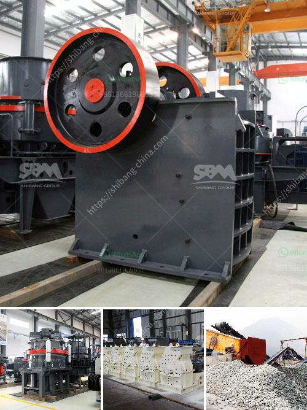

<h3>iron ore processing machine</h3>
Iron ore is one of the most important materials used in various industries. The extraction, beneficiation, and processing of iron ore involve many different techniques that depend on the type of ore and the final product desired. Iron ores are usually rich in iron oxides, and vary in color from dark grey, bright yellow, deep purple, to rusty reds.

A variety of processes, equipment, and technology are available for iron ore processing. The choice of processing depends on the nature of the ore and the desired product. Here are some of the commonly used methods in iron ore processing.

Crushing and grinding: As the first step in the iron ore processing, ores are crushed into small size particles. The crushed ores then undergo grinding to reduce the size to a suitable fineness for beneficiation.

Magnetic separation: Magnetic separation is one of the most widely used methods to beneficiate iron ores. In this process, a magnetic field is applied to the crushed ore particles. As a result, the magnetic particles are attracted to the magnetic drum, while the non-magnetic particles pass through. This separation technique is effective in removing impurities and increasing the iron content of the ore.

Gravity separation: Gravity separation is commonly used in iron ore beneficiation. It uses the specific gravity difference between the iron ore and associated gangue minerals. The crushed ore is fed onto a shaking table, where the heavier iron ore particles settle and are collected as concentrate, while the lighter gangue minerals are washed away.

Flotation: Flotation is a commonly used method of separating iron minerals from gangue minerals. The ore is ground to a fine size and mixed with water and specific chemicals. Air bubbles are then introduced into the slurry, and the hydrophobic iron minerals attach to the bubbles and float to the surface, forming a froth layer. This froth is skimmed off, and the concentrate is further processed.

Dewatering and drying: After beneficiation, the iron ore concentrate is dewatered, usually through thickening and filtration processes, and then dried. Drying helps to reduce the moisture content, making the concentrate suitable for transportation or storage.

Various types of equipment are involved in the iron ore processing. These include crushers, grinding mills, magnetic separators, flotation machines, and compactors.

Jaw Crusher: This primary crusher is used to break large chunks of rock and ore into smaller particles. It features a heavy-duty design, excellent crushing capacity, and high reliability.

Ball Mill: The ball mill is a key piece of equipment for grinding crushed materials. It is widely used in production lines for powders such as cement, silicates, refractory material, fertilizer, glass ceramics, etc., as well as for ore dressing of both ferrous and non-ferrous metals.

Magnetic Separator: This equipment is used for separating magnetic materials from non-magnetic materials. It utilizes a magnetic field to attract and separate magnetic particles from the ore mixture.

Flotation Machine: The flotation machine is used for separating valuable minerals from ore. It relies on the principle that different minerals have different affinities for water. It creates air bubbles, which carry the valuable minerals to the surface for collection.

Compactors: Compactors are used to compress iron ore fines into dense briquettes or pellets, which are easy to handle and transport. These densified products have improved flowability, reduce dust generation during transportation, and facilitate uniform charging in blast furnaces.

In conclusion, iron ore processing involves a range of techniques and equipment, depending on the nature of the ore and desired product. From crushing and grinding to magnetic separation, flotation, and drying, various methods are available to achieve the desired iron ore quality and consistency. The key equipment includes crushers, grinding mills, magnetic separators, flotation machines, and compactors, among others. These machines ensure efficient and reliable processing of iron ore, resulting in high-quality end products that are essential for various industries.
<h3>Contact us</h3><ul><li><strong>Whatsapp:&nbsp;<a href="https://wa.me/8613661969651">+8613661969651</a></strong></li><li><a href="https://swt.shibang-china.com/?git&amp;zhl&amp;iron ore processing machine"><strong>Online Service(chat now)</strong></a></li></ul><h3>Related</h3><ul><li><a href='harga mesin sekunder stone crusher bekas.md'>harga mesin sekunder stone crusher bekas</a></li><li><a href='used portable crusher for sale south africa.md'>used portable crusher for sale south africa</a></li><li><a href='ball mill grinding manufacturer in india.md'>ball mill grinding manufacturer in india</a></li><li><a href='vibrating screen manufacture in philippines.md'>vibrating screen manufacture in philippines</a></li><li><a href='quarry machines and prices.md'>quarry machines and prices</a></li></ul>