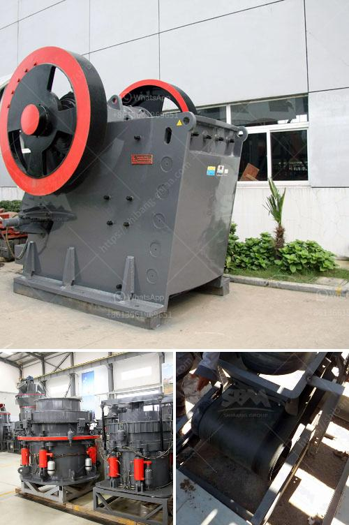

<h3>iron ore processing plant design pdf</h3>
Iron ore processing plant is a complex process that involves many steps in the production of iron ore concentrate and pellets. It involves a number of different processing units and involves various types of equipment.

1. The design of the plant must be optimized to meet the production requirements of the product. This is necessary to ensure efficient operation and create a cost-effective process.

2. The design of the plant must be environmentally friendly, ensuring minimal impact on the surroundings. This includes taking into consideration emissions, waste management, and carbon footprint.

3. The plant design must consider the quality of the final products. It must ensure that the iron ore concentrate produced meets the specifications required by the customers.

4. The plant design must ensure a high level of safety and reliability. This includes designing the plant layout, selecting reliable equipment, and implementing safety measures to protect the workers and the equipment.

1. Crushing and grinding: This is the first step in the process. After the ore is sent to the jaw crusher for primary crushing, it is sent to the cone crusher for secondary crushing. Then, the crushed ore is sent to the ball mill for grinding.

2. Concentration: The crushed and ground ore is sent to the magnetic separator, where iron ore particles are separated from the non-magnetic ones. This process is important for obtaining a high-quality iron ore concentrate.

3. Pelletizing: The iron ore concentrate is then mixed with additives and binders and compressed into pellets. These pellets are then sent to a furnace for high-temperature processing, which prepares them for use in steel production.

4. Drying and packaging: The pellets are dried to remove any moisture and then packaged for shipment to customers. The packaging must be carefully designed to ensure the pellets remain protected during transportation.

The process of designing an iron ore processing plant involves several considerations. These include the geological characteristics of the ore body, including its size, shape, and grade. The location and accessibility of the mine site are also important factors to consider.

Other factors that influence the plant design include the available infrastructure, such as power supply and water sources, as well as environmental regulations and permit requirements. All of these factors must be taken into account to ensure the successful design and implementation of an iron ore processing plant.

In conclusion, the design of an iron ore processing plant is a complex and multidisciplinary task that requires expertise from various fields. The design must be optimized to meet the production requirements while ensuring environmental sustainability, product quality, and safety. A well-designed plant will be efficient, safe, and reliable, contributing to the overall success of the iron ore processing operation.
<h3>Contact us</h3><ul><li><strong>Whatsapp:&nbsp;<a href="https://wa.me/8613661969651">+8613661969651</a></strong></li><li><a href="https://swt.shibang-china.com/?git&amp;zhl&amp;iron ore processing plant design pdf"><strong>Online Service(chat now)</strong></a></li></ul><h3>Related</h3><ul><li><a href='manufacturers of cement grinding units in india.md'>manufacturers of cement grinding units in india</a></li><li><a href='used stone crushers for sale germany.md'>used stone crushers for sale germany</a></li><li><a href='hammer mill mining.md'>hammer mill mining</a></li><li><a href='gold mining equipment washing machines.md'>gold mining equipment washing machines</a></li><li><a href='mobile stone crushing plants price.md'>mobile stone crushing plants price</a></li></ul>