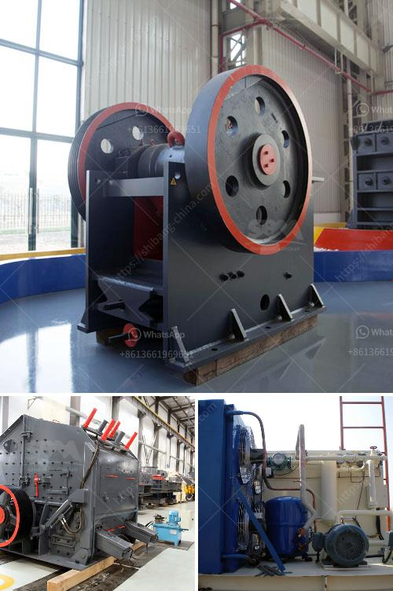

<h3>iron processing machine</h3>
Iron processing machines have revolutionized the manufacturing industry, enabling efficient and precise metal fabrication processes. These machines have played a significant role in enhancing productivity, reducing human error, and achieving consistent quality standards. With their advanced features and capabilities, iron processing machines have become indispensable in a wide range of industries.

One of the primary iron processing machines used today is the CNC (Computer Numerical Control) machine. CNC machines have transformed the way iron is processed by employing computer programming to control the movement and operation of the machine. This automation allows for highly accurate and repeatable production processes, ensuring consistent results.

The CNC machine utilizes various tools and techniques to process iron, such as drilling, milling, turning, and grinding. These machines can handle complex geometries and intricate designs, making them highly versatile. Whether it's cutting sheets, shaping bars, or drilling holes, the CNC machine ensures precision and efficiency in every operation.

Another type of iron processing machine commonly used is the ironworker. Ironworkers are heavy-duty machines designed specifically for cutting, punching, notching, and bending iron plates and bars. They are widely used in construction, metal fabrication, and manufacturing industries for a variety of applications, including structural steelwork, shipbuilding, and ornamental ironwork.

Ironworkers are equipped with powerful hydraulic systems, making them capable of exerting immense force to shape and manipulate iron. They come with a range of tools and attachments, such as punches, shears, and notchers, providing versatility and flexibility in processing iron. Ironworkers also incorporate safety features to prevent accidents and ensure operator protection.

In recent years, advancements in technology have led to the development of more sophisticated and efficient iron processing machines. For instance, laser cutting machines have become increasingly popular due to their ability to cut precise and intricate patterns in iron sheets. By harnessing the power of high-energy lasers, these machines offer fast and clean cutting processes, eliminating the need for secondary operations.

Moreover, automated iron processing machines have significantly increased productivity levels within manufacturing facilities. These machines can operate 24/7, requiring minimal human intervention. They can handle large volumes of iron processing tasks without compromising on quality or precision. This has resulted in shorter lead times, reduced costs, and improved overall efficiency in the production process.

Iron processing machines have also embraced sustainability and environmental considerations. Modern machines are designed to optimize energy consumption and minimize waste generation. By implementing smart technologies and energy-efficient components, manufacturers can reduce their carbon footprint without compromising on performance or quality.

Overall, iron processing machines have revolutionized the way iron is fabricated, providing countless advantages to various industries. From CNC machines that enable precise and complex operations to ironworkers that shape and manipulate heavy iron plates and bars, these machines have enhanced productivity, efficiency, and quality standards. With the constant advancements in technology, iron processing machines continue to evolve, promising even greater innovations in the future.
<h3>Contact us</h3><ul><li><strong>Whatsapp:&nbsp;<a href="https://wa.me/8613661969651">+8613661969651</a></strong></li><li><a href="https://swt.shibang-china.com/?git&amp;zhl&amp;iron processing machine"><strong>Online Service(chat now)</strong></a></li></ul><h3>Related</h3><ul><li><a href='rock crusher production screen mesh.md'>rock crusher production screen mesh</a></li><li><a href='mining process of marble.md'>mining process of marble</a></li><li><a href='prices of gemini concentrating tables manufacturers.md'>prices of gemini concentrating tables manufacturers</a></li><li><a href='three roller mill in china.md'>three roller mill in china</a></li><li><a href='ballast crushing project.md'>ballast crushing project</a></li></ul>