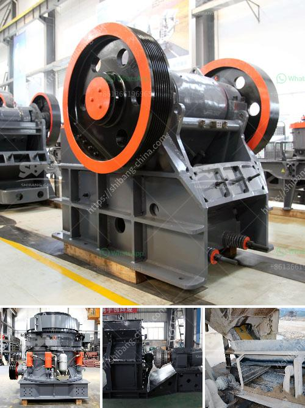

<h3>iron washer making machine with price in india</h3>
Iron washer making machine, a crucial component in the manufacturing industry, has simplified the process of producing washers. These machines are designed to effectively create standardized iron washers, eliminating the need for manual labor. In India, the demand for iron washer making machines has been on the rise due to the country's flourishing industrial sector. In this article, we will discuss the features, benefits, and prices of iron washer making machines in India.

Iron washer making machines are known for their efficiency and precision. They are equipped with advanced technology that allows for precise cutting, shaping, and drilling of iron sheets to create uniform washers. The machines are designed to handle different sizes and thicknesses of iron sheets, providing versatility in washer production. Additionally, these machines ensure high-speed production, resulting in increased productivity for manufacturers.

One of the key benefits of using an iron washer making machine is its time-saving aspect. Unlike traditional methods where workers manually cut and shape washers, these machines automate the entire process. This not only reduces labor costs but also eliminates human error, resulting in high-quality washers. Moreover, these machines are designed to enhance the durability and strength of washers, ensuring longevity in their usage.

In terms of pricing, iron washer making machines in India can range from INR 2,50,000 to INR 5,00,000 depending on the specific features and capacity. Machines with higher production capacities usually come at a relatively higher price. However, investing in a high-quality machine can significantly benefit manufacturers in the long run due to improved efficiency and increased production output.

Several manufacturers in India offer a wide range of iron washer making machines. It is important to consider factors such as technical specifications, capacity, and durability while making a purchase decision. Additionally, manufacturers often provide after-sales services, including installation, training, and maintenance support, which should be taken into consideration while selecting a supplier.

When purchasing an iron washer making machine, it is crucial to assess the requirements of your manufacturing unit. Consider the size and thickness of the iron sheets you will be using, as well as the desired production capacity. By understanding your needs, you can make an informed choice and select a machine that meets your specific requirements.

In conclusion, iron washer making machines have revolutionized the manufacturing industry in India by simplifying the process of producing washers. Their efficiency, precision, and high-speed production capabilities have led to increased productivity and reduced labor costs for manufacturers. While the prices of these machines vary depending on their features and capacity, it is important to invest in a high-quality machine to ensure long-term benefits. By considering factors such as technical specifications and after-sales support, manufacturers can select the most suitable iron washer making machine for their operations.
<h3>Contact us</h3><ul><li><strong>Whatsapp:&nbsp;<a href="https://wa.me/8613661969651">+8613661969651</a></strong></li><li><a href="https://swt.shibang-china.com/?git&amp;zhl&amp;iron washer making machine with price in india"><strong>Online Service(chat now)</strong></a></li></ul><h3>Related</h3><ul><li><a href='limestone crusher kenya.md'>limestone crusher kenya</a></li><li><a href='mini concrete crusher in united kingdom.md'>mini concrete crusher in united kingdom</a></li><li><a href='used iron ore impact crusher for hire.md'>used iron ore impact crusher for hire</a></li><li><a href='pf trituradora de impacto.md'>pf trituradora de impacto</a></li><li><a href='how to start sand business in nigeria.md'>how to start sand business in nigeria</a></li></ul>