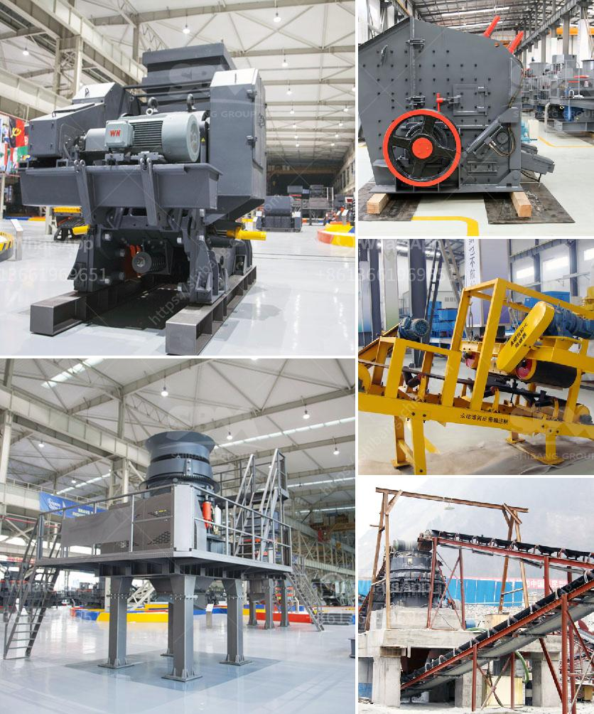

<h3>japan crushing machine manufacturers list</h3>
Japan is well-known for its cutting-edge technology and machinery industry. The country is home to some of the most renowned manufacturers in various fields, including the crushing machine industry. These manufacturers have gained a reputation for producing high-quality and efficient machines that are widely used in various industrial sectors. In this article, we will explore some of the top crushing machine manufacturers in Japan.

One of the leading manufacturers in Japan's crushing machine industry is Komatsu. The company was established in 1921 and has a long history of producing top-of-the-line construction and mining equipment. Komatsu's crushing machines are known for their durability and efficiency. They offer a wide range of machines, including jaw crushers, cone crushers, and impact crushers, which are widely used in the construction and mining sectors.

Another reputable manufacturer in Japan is Kawasaki Heavy Industries. This company has been operating for over a century and has established itself as a key player in the machinery industry. Kawasaki's crushing machines are renowned for their advanced technology and reliability. Their machines are widely used in various industries, including quarrying, mining, and recycling.

Nakayama Iron Works is another prominent crushing machine manufacturer in Japan. The company was founded in 1908 and has a long-standing tradition of producing high-quality machinery. Nakayama's crushing machines are known for their compact size and excellent performance. They offer a range of machines, including mobile crushers, which are highly convenient and efficient for on-site crushing operations.

Kyoto Tool Co., Ltd. is a renowned manufacturer of crushing machines in Japan. The company was established in 1940 and has a rich history of providing innovative and reliable machinery solutions. Kyoto Tool's crushing machines are widely used in the automotive industry, where they help in the recycling and disposal of used vehicles. Their machines are designed to efficiently crush and separate different components of the vehicles, contributing to the sustainable management of waste materials.

Ishii Engineering Co., Ltd. is another respected manufacturer in the crushing machine industry. The company specializes in producing crushers for various applications, including construction, mining, and recycling. Ishii Engineering's machines are known for their robust construction and high productivity. They offer a range of machines, including jaw crushers, cone crushers, and impact crushers, which cater to different crushing needs.

In conclusion, Japan boasts a list of reputable crushing machine manufacturers that are known for their technological advancements and high-quality machinery. Companies like Komatsu, Kawasaki Heavy Industries, Nakayama Iron Works, Kyoto Tool Co., Ltd., and Ishii Engineering Co., Ltd. have established themselves as key players in the industry. Their machines are widely used across various sectors, thanks to their durability, efficiency, and reliability. These Japanese manufacturers are continually innovating and improving their products to meet the ever-growing demands of the crushing machine market.
<h3>Contact us</h3><ul><li><strong>Whatsapp:&nbsp;<a href="https://wa.me/8613661969651">+8613661969651</a></strong></li><li><a href="https://swt.shibang-china.com/?git&amp;zhl&amp;japan crushing machine manufacturers list"><strong>Online Service(chat now)</strong></a></li></ul><h3>Related</h3><ul><li><a href='cheap gravel crusher.md'>cheap gravel crusher</a></li><li><a href='rumus perhitungan kapasitas jaw crusher.md'>rumus perhitungan kapasitas jaw crusher</a></li><li><a href='small mobile rock pulverizer.md'>small mobile rock pulverizer</a></li><li><a href='big slage crusher mechins plant.md'>big slage crusher mechins plant</a></li><li><a href='crushing plant for river materials in europe.md'>crushing plant for river materials in europe</a></li></ul>