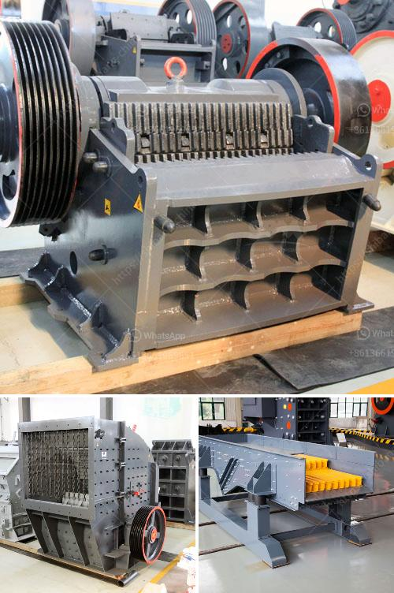

<h3>jaw and cone crusher suppliers in mokopane</h3>
When it comes to construction projects, crushers are essential equipment that can significantly simplify the process. Jaw and cone crushers are widely used in the mining and aggregate industries to reduce the size of raw materials and facilitate the production of finer particles for further processing. If you are in Mokopane or the surrounding areas and looking for reliable jaw and cone crusher suppliers, this article will guide you through the selection process.

In Mokopane, there are several jaw and cone crusher suppliers that offer a wide range of equipment suitable for various applications. These suppliers provide both new and used machines, offering flexibility based on your budget and specific project requirements. Before making a decision, it is important to consider certain factors to ensure that you choose the right supplier.

One crucial aspect is the reputation and experience of the supplier. Look for suppliers that have been in the industry for a significant amount of time and have positive reviews from their previous customers. A reputable supplier will not only provide quality crushers but also offer comprehensive after-sales services and support. This includes maintenance, repairs, and spare parts availability, ensuring that your crusher continues to operate at its optimal performance.

It is also essential to assess the supplier's range of products. Jaw and cone crushers come in various sizes and capacities to cater to different project needs. The supplier should have a diverse inventory that can accommodate the specific requirements of your project, whether it is a small residential construction or a large commercial development.

Furthermore, consider the equipment's durability and efficiency. A high-quality crusher should be built with robust materials and engineered to withstand the demanding conditions of the construction industry. Look for suppliers that partner with reputable manufacturers known for their reliable and innovative designs. Suppliers that offer technologically advanced crushers will not only enhance your productivity but also reduce operational costs in the long run.

Another factor to consider is the supplier's customer service. Construction projects often have strict timelines, and any delay in equipment delivery can hinder progress and result in financial losses. Choose a supplier that is responsive and has a track record of delivering equipment on time. Additionally, it is important to have open communication with the supplier, where they can provide expert advice and guidance on selecting the most suitable jaw or cone crusher for your specific project needs.

Lastly, compare prices and warranties offered by different suppliers. While the cost is a significant consideration, remember that quality should not be compromised for a lower price. It is worth investing in a reliable and efficient crusher that will ensure smooth operations and minimal downtime. Check if the supplier offers warranties for their equipment, as this demonstrates their confidence in the product's quality.

In conclusion, choosing the right jaw and cone crusher supplier in Mokopane is crucial for the success of your construction project. Consider the supplier's reputation, experience, range of products, durability, efficiency, customer service, prices, and warranties. By taking these factors into account, you can make an informed decision that will contribute to the smooth progress of your construction endeavors.
<h3>Contact us</h3><ul><li><strong>Whatsapp:&nbsp;<a href="https://wa.me/8613661969651">+8613661969651</a></strong></li><li><a href="https://swt.shibang-china.com/?git&amp;zhl&amp;jaw and cone crusher suppliers in mokopane"><strong>Online Service(chat now)</strong></a></li></ul><h3>Related</h3><ul><li><a href='raymond mill supplier.md'>raymond mill supplier</a></li><li><a href='conveyor belts in east africa.md'>conveyor belts in east africa</a></li><li><a href='vibrating screens price in south africa.md'>vibrating screens price in south africa</a></li><li><a href='steel slag cement manufacture process ppt.md'>steel slag cement manufacture process ppt</a></li><li><a href='stone transport belt conveyor.md'>stone transport belt conveyor</a></li></ul>