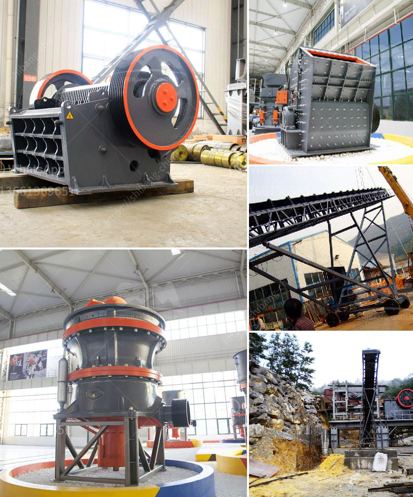

<h3>jaw bone crusher made in britain</h3>
In the realm of heavy machinery, one name shines brightly for its quality, precision, and durability - the Jaw Bone Crusher. Manufactured with utmost perfection in Britain, this remarkable crushing equipment has proven its mettle in a wide range of industries, from construction to mining. With its relentless power and robust design, the Jaw Bone Crusher stands as a testament to British engineering excellence.

The Jaw Bone Crusher is specifically designed to pulverize even the toughest materials, showcasing its immense strength and versatility. Equipped with a formidable jaw configuration, it can effortlessly crush boulders, rocks, concrete, and various other materials. This machine's ability to handle such a diverse range of materials is partly thanks to Britain's long history of innovation and engineering prowess.

One striking feature of the Jaw Bone Crusher is its impeccable design, which magnifies both efficiency and safety. The crushing mechanism is meticulously engineered to minimize vibrations, guaranteeing not only smooth operation but also reducing fatigue on the machine's components. Moreover, the ergonomically designed control panel ensures that operators have optimal control over every crushing operation.

A testament to British craftsmanship, the Jaw Bone Crusher is manufactured using premium-grade materials, ensuring unparalleled durability. The cutting-edge welding techniques employed in its production result in a machine that can withstand the harshest conditions. This uncompromising construction utilizes only the finest materials, extending the longevity of the crusher and minimizing maintenance costs.

The Jaw Bone Crusher's adaptability sets it apart from other crushing machines on the market. Its straightforward design, combined with the adjustable jaw opening, allows operators to easily modify the machine's capabilities to suit different requirements. From reducing demolition waste to preparing aggregates for construction projects, this crusher excels in a multitude of applications.

In line with Britain's commitment to sustainability, the Jaw Bone Crusher is engineered to maximize energy efficiency during operation. By employing advanced motor technology and intelligent power management systems, this machine consumes significantly less energy compared to its counterparts. Not only does it help businesses reduce their carbon footprint, but it also helps optimize operating costs.

Purchasing a Jaw Bone Crusher means gaining access to exceptional customer support and maintenance services. Manufacturers in Britain value their reputation for maintaining long-term relationships with their customers. Experts are readily available to provide technical support, service, and spare parts, ensuring minimal downtime and maximum productivity.

The Jaw Bone Crusher is an exemplary product manufactured in Britain that exemplifies the nation's engineering brilliance. Through its unprecedented power, precision design, and unwavering durability, it has carved its own niche in the global market. For businesses seeking a reliable and efficient crushing solution, the Jaw Bone Crusher undoubtedly deserves consideration as a superb British-made option.
<h3>Contact us</h3><ul><li><strong>Whatsapp:&nbsp;<a href="https://wa.me/8613661969651">+8613661969651</a></strong></li><li><a href="https://swt.shibang-china.com/?git&amp;zhl&amp;jaw bone crusher made in britain"><strong>Online Service(chat now)</strong></a></li></ul><h3>Related</h3><ul><li><a href='machinery used in making dolomite powder.md'>machinery used in making dolomite powder</a></li><li><a href='used stone crusher machine in italia.md'>used stone crusher machine in italia</a></li><li><a href='mobile crusher china.md'>mobile crusher china</a></li><li><a href='layout design for stone crushing plant.md'>layout design for stone crushing plant</a></li><li><a href='drawing for sand washing machines crusher mill.md'>drawing for sand washing machines crusher mill</a></li></ul>