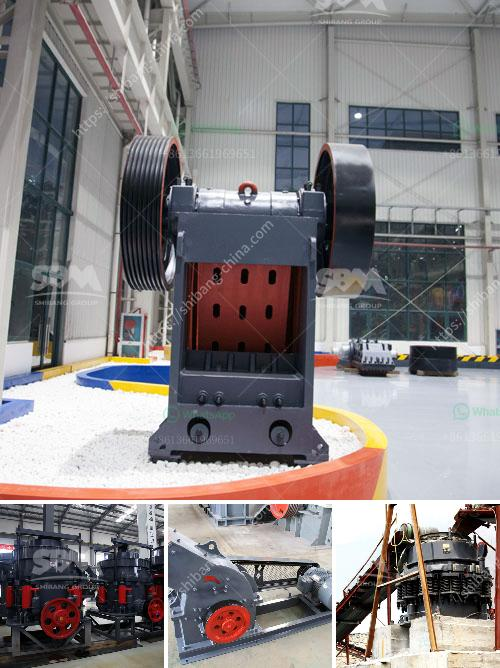

<h3>jaw crusher 150 250 para la venta</h3>
La venta de la trituradora de mandíbula 150 250, o jaw crusher 150 250, es un equipo de trituración esencial en la industria minera y de construcción. Este tipo de trituradora es ampliamente utilizado debido a su alta eficiencia en la trituración de materiales duros y abrasivos. Con una capacidad de producción de hasta 15-45 toneladas por hora, el jaw crusher 150 250 se ha convertido en la opción preferida para muchos negocios.

Una de las principales ventajas del jaw crusher 150 250 es su estructura simple y compacta. Está compuesta por una mandíbula fija y una mandíbula móvil, que se mueven hacia adelante y hacia atrás para triturar el material. Gracias a su diseño robusto, este tipo de trituradora puede soportar cargas pesadas y garantizar una alta eficiencia de trituración.

Otra característica destacada del jaw crusher 150 250 es su versatilidad. Puede triturar una amplia gama de materiales, incluyendo piedra caliza, granito, basalto, mineral de hierro, mineral de cobre, escoria de alto horno y muchos otros. Además, es capaz de ajustar el tamaño de salida del material triturado, lo que permite obtener diferentes tamaños de partículas según las necesidades del cliente.

El jaw crusher 150 250 también es conocido por su bajo consumo de energía. Su motor de alta potencia garantiza una operación eficiente sin aumentar significativamente los costos operativos. Esto lo convierte en una opción económica para aquellos que buscan maximizar la productividad sin comprometer la rentabilidad.

Además de su eficiencia y versatilidad, la trituradora de mandíbula 150 250 también tiene un mantenimiento sencillo. Las piezas de desgaste, como las mandíbulas, se pueden reemplazar fácilmente cuando sea necesario, lo que prolonga la vida útil del equipo y reduce los costos de reparación.

En resumen, el jaw crusher 150 250 es una opción confiable y versátil para la trituración de diversos materiales en la industria minera y de construcción. Su alta eficiencia, estructura simple y compacta, y bajo consumo de energía lo convierten en una inversión rentable a largo plazo. Si estás en busca de una trituradora de mandíbula para tu negocio, considera seriamente la opción del jaw crusher 150 250.
<h3>Contact us</h3><ul><li><strong>Whatsapp:&nbsp;<a href="https://wa.me/8613661969651">+8613661969651</a></strong></li><li><a href="https://swt.shibang-china.com/?git&amp;zhl&amp;jaw crusher 150 250 para la venta"><strong>Online Service(chat now)</strong></a></li></ul><h3>Related</h3><ul><li><a href='machinery used in making dolomite powder.md'>machinery used in making dolomite powder</a></li><li><a href='sand washing machinery.md'>sand washing machinery</a></li><li><a href='how to make marble powder statues.md'>how to make marble powder statues</a></li><li><a href='chrome lead ore vsi crusher manufacturer.md'>chrome lead ore vsi crusher manufacturer</a></li><li><a href='cost of steel slag in tamil nadu.md'>cost of steel slag in tamil nadu</a></li></ul>