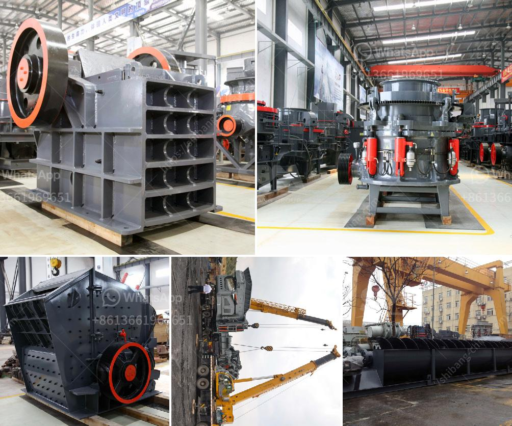

<h3>jaw crusher calculating</h3>
When it comes to crushing large materials, such as stones or ores, a jaw crusher is a primary crushing machine used frequently in industrial settings. It is a versatile machine that requires careful calculations to ensure efficiency and maximum productivity. In this article, we will break down the key factors to consider when calculating the performance of a jaw crusher. 

1. Feed size: The size of the material that needs to be crushed plays a crucial role in determining the capacity and efficiency of the jaw crusher. A larger feed size may require a bigger machine with higher capacity, while a smaller feed size can be handled by smaller crushers.

2. Capacity: The capacity of the jaw crusher is the amount of material that can be processed per unit time. It is important to determine the desired production rate and select a jaw crusher with appropriate capacity to meet those requirements. The capacity should be calculated considering factors like the feed size, material density, and desired product size.

3. Power requirements: The power consumption of a jaw crusher is an important factor to consider as it determines the operating cost of the equipment. It is essential to calculate the power requirements accurately to ensure efficient and cost-effective operation. The power consumption can be estimated based on the feed size, material properties, and crusher efficiency.

4. Crusher efficiency: The efficiency of a jaw crusher is the percentage of the input energy that is converted into crushing action or product size reduction. Higher efficiency means less energy waste and improved crushing performance. It is usually measured by the ratio of the product size to the feed size and can be improved by adjusting the crusher settings, such as the closed side setting.

In conclusion, calculating the performance of a jaw crusher involves considering factors such as feed size, capacity, power requirements, and crusher efficiency. These calculations are vital for achieving optimal productivity, reducing operating costs, and maximizing the lifespan of the equipment. By carefully analyzing and understanding these factors, one can select the right jaw crusher for their specific needs and ensure efficient and effective crushing operations.
<h3>Contact us</h3><ul><li><strong>Whatsapp:&nbsp;<a href="https://wa.me/8613661969651">+8613661969651</a></strong></li><li><a href="https://swt.shibang-china.com/?git&amp;zhl&amp;jaw crusher calculating"><strong>Online Service(chat now)</strong></a></li></ul><h3>Related</h3><ul><li><a href='jaw crusher tanzania.md'>jaw crusher tanzania</a></li><li><a href='price mobile crusher.md'>price mobile crusher</a></li><li><a href='project cost of a cement plant.md'>project cost of a cement plant</a></li><li><a href='ballast crushing machine prices in kenya.md'>ballast crushing machine prices in kenya</a></li><li><a href='typical roll and roll mill.md'>typical roll and roll mill</a></li></ul>