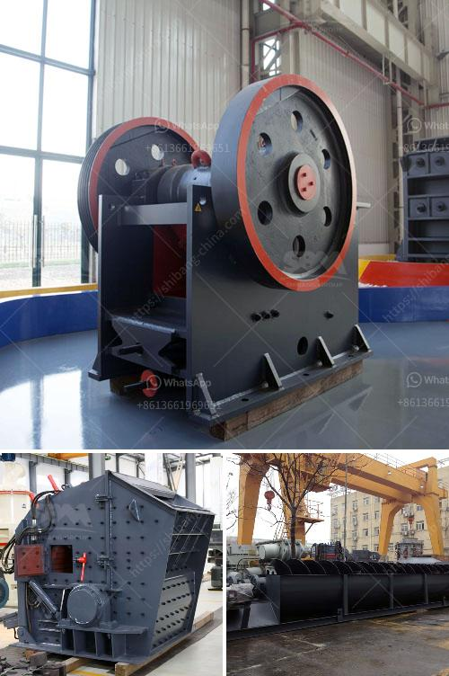

<h3>jaw crusher design</h3>
Jaw crushers are designed to exceed the primary crushing needs of customers in the mining, quarrying, and recycling industries. These machines are among the most advanced and reliable in the market and are highly productive in a variety of applications. However, despite their sophisticated design, the success of jaw crushers in various operations still depends on the ability to design them properly.

The design of a jaw crusher is based on the fundamental principle of crushing. Crushers can be classified into two main categories, compression crushers, and impact crushers. Jaw crushers are compression crushers, where the material is crushed by squeezing them until the breakage occurs. The mechanism of crushing is either by applying impact force, pressure, or a combination of both.

The jaw crusher is primarily a compression crusher, while the others operate primarily by the application of impact. The working principle of a crusher is simple and straightforward. Motor-driven equipment such as a belt-driven motor will help you achieve the desired motion. Similar to a common jaw crusher, the motor passes the power to the belt, which in turn drives the flywheel at a high speed.

Once the flywheel reaches a certain rotational speed, it produces enough mechanical force to break the crusher's materials. As it rotates, the eccentric shaft forces the movable jaw to move back and forth, and the materials are crushed due to the squeezing motion between the movable and fixed jaws. The crushed materials are discharged through the bottom discharge opening.

When it comes to jaw crusher design, the factors that need to be considered are the material feed size and the required output size. The materials will be crushed based on the mechanism of compression, which allows for reduction in size of the feed material. This is essential in order to achieve the desired product size.

One of the main advantages of jaw crushers is their ability to crush materials of any hardness, as well as their low-cost operation and easy maintenance. Another advantage of jaw crushers is their versatility. They can be used in different industries such as quarrying, mining, and recycling, depending on the application requirements. Jaw crushers are also highly efficient, with low operating costs due to their robust design.

However, despite the numerous advantages, there are a few disadvantages associated with jaw crushers. One major disadvantage is their potential to generate large quantities of dust, which can be a health hazard for workers, as well as cause pollution in the surrounding environment. Additionally, if the jaw crusher is not properly maintained and operated, it can result in frequent breakdowns, leading to increased downtime and maintenance costs.

In conclusion, jaw crushers are an essential piece of equipment in the mining, quarrying, and recycling industries. The design of jaw crushers should incorporate the necessary features to reduce the operating costs, improve the crushing efficiency, and ensure the safety of both the operator and the working environment.
<h3>Contact us</h3><ul><li><strong>Whatsapp:&nbsp;<a href="https://wa.me/8613661969651">+8613661969651</a></strong></li><li><a href="https://swt.shibang-china.com/?git&amp;zhl&amp;jaw crusher design"><strong>Online Service(chat now)</strong></a></li></ul><h3>Related</h3><ul><li><a href='chinese limestone mining investors.md'>chinese limestone mining investors</a></li><li><a href='bentonite grinding mill.md'>bentonite grinding mill</a></li><li><a href='talc powder grinding mills in lahore.md'>talc powder grinding mills in lahore</a></li><li><a href='clinker grinding plant india.md'>clinker grinding plant india</a></li><li><a href='harga mesin pemecah batu merek jepang.md'>harga mesin pemecah batu merek jepang</a></li></ul>