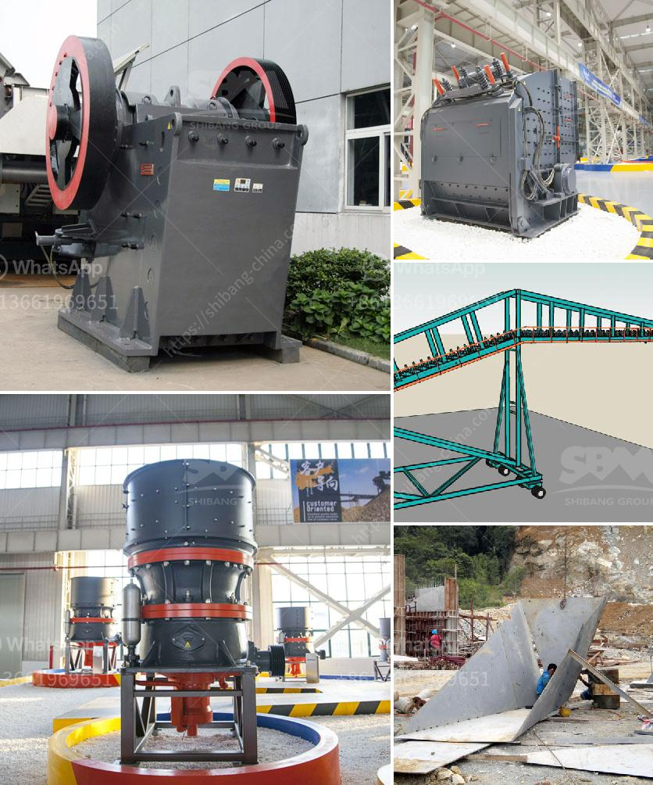

<h3>jaw crusher for 100x200</h3>
The jaw crusher is a reliable and robust piece of equipment that is designed to perform efficiently and effectively in a variety of crushing applications. This versatile machine can accommodate different types of materials, such as granite, limestone, and even concrete, making it suitable for a wide range of industrial sectors.

One of the key features of the jaw crusher is its ability to crush materials to a specific size. With a feeding opening of 100x200mm, it can handle various sizes of rocks and stones with ease. The adjustable discharge setting allows for precise control over the final product size, providing the user with the flexibility to meet specific requirements.

The 100x200 jaw crusher has a maximum feed size of 100mm and a maximum crushing capacity of 300kg/h. This makes it ideal for small-scale crushing operations or laboratories where small batches of materials need to be crushed for analysis or testing purposes.

In terms of performance, the jaw crusher delivers efficient and reliable operation. The powerful motor ensures that the machine can handle heavy loads and continuous operation without any issues. The sturdy construction of the crusher further enhances its durability, allowing it to withstand the rigors of demanding crushing applications.

Maintenance and servicing of the jaw crusher are also straightforward. The machine is designed with easy access to the crushing chamber, allowing for quick and convenient inspection and cleaning. The wear parts, such as the jaw plates, can be easily replaced, ensuring minimal downtime and maximum productivity.

Overall, the 100x200 jaw crusher is a dependable and efficient piece of equipment that provides high-quality crushing performance. Whether for small-scale crushing operations, laboratories, or other industrial applications, this machine offers versatility, reliability, and ease of maintenance. With its ability to handle various materials and precise control over the final product size, the jaw crusher is a valuable asset for any crushing operation.
<h3>Contact us</h3><ul><li><strong>Whatsapp:&nbsp;<a href="https://wa.me/8613661969651">+8613661969651</a></strong></li><li><a href="https://swt.shibang-china.com/?git&amp;zhl&amp;jaw crusher for 100x200"><strong>Online Service(chat now)</strong></a></li></ul><h3>Related</h3><ul><li><a href='gravel stone crusher plant.md'>gravel stone crusher plant</a></li><li><a href='best crushers for manufactured sand.md'>best crushers for manufactured sand</a></li><li><a href='how to start sand business in nigeria.md'>how to start sand business in nigeria</a></li><li><a href='copper mining process.md'>copper mining process</a></li><li><a href='harga vibrating screen.md'>harga vibrating screen</a></li></ul>