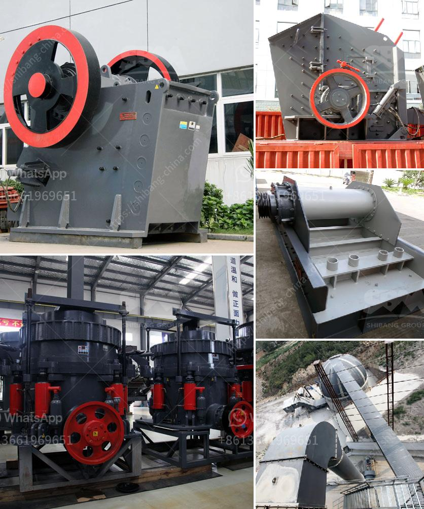

<h3>jaw crusher for chrome ore for sale</h3>
Chromium ore is mainly a byproduct of the production of zinc metal from sulfide ore concentrates. So typical cadmium ore crushing is also the crushing of zinc ores. The mined zinc ores are crushed and ground by cadmium ore crushers and cadmium mills to liberate the zinc sulfide particles from the waste host rock.

During the process of chrome ore, the jaw crusher, designed and developed by our company, becomes the most suitable coarse crushing equipment, well-known jaw crusher.

The jaw crusher is rugged, reliable, and it is used in the breaking of giant rocks into small stones. The jaw crusher is created to be secure to operate and maintain. You can find a restricted quantity of service points and they can be accessed very easily and safely.

We can sell jaw crushers for chrome ore jaw crusher is used for coarse crushing chromite ore into small pieces. Jaw Crusher has the features of great crushing ratio, uniform sizes of performance. It is widely used in various industries, such as mining, smelting, road and railway construction and chemical industry etc. Mobile Crushing Plant DM 7 Mobile Crushing Plant DM 9

Jaw Crusher is one of the most popular stone-crushing equipments in the world, Jaw Crusher is ideally suitable for primary and secondary crushing. The highest anti-pressure strength of crushed material is 320MPa. Our design and production are of high position both at home and abroad.

The Jaw crusher and impact crusher also used in chromite (chrome ore) crushing plant. Here is a common chromite (chrome ore) crushing plant: vibrating feeder + jaw crusher + cone crusher + vibrating screen. The third stage: milling and powder selection. The material entering the grinding head bin is ground into a special ceramic ball mill through the feeder, and the ground material is transported into the conveyor to the high-efficiency classifier for classifying the quartz stone ultrafine powder 140 mesh, 325 mesh, 600 mesh, 1000 mesh. 1,1600 mesh.

Processing chromite ore crushing plant jaw crusher, cone crusher, impact crusher and mobile crusher such as portable mobile crusher for chromite will be the most suitable equipment. The chromite crusher is widely used in in inda, Russia, Albania, the Philippines, Zimbabwe, Turkey, Brazil, India. Get Price And Support Online Chromite Ore Used Mobile Crusher - spitsid.

To process chromite, crushing is the first stage. So in this article, we mainly introduce chromite crushing machine with low price. Large raw chrome ore for primary crushing are fed into the jaw crusher by Plate feeder and are reduced to 8 inches or smaller. After first crushing, the material will be transferred to cone crusher by belt conveyor for secondary crushing; the crushed chrome ore stone will then transferred to vibrating screen for classifying. After classifying, the parts whose size below the mesh size will be transferred away as final products, while the other parts will return to cone crusher, thus forming a closed circuit. Size of final products can be adjust and graded according to your specific requirement.

Jaw crusher and cone crusher are the classical laminated crushers, and also the most popular crushers while impact crusher adopts impact crushing principle. In general, jaw crusher is used as the primary crusher, and cone crusher and impact crusher as the secondary. And they always combine with each other in the whole crushing line during the crushing process. Comparison of crushing principles Different crushing principle of jaw crusher, cone crusher and impact crusher

Jaw crusher and cone crusher adopt the laminating crushing principle, known as extrusion crushing principle. Although the crushing actuators are different, the nature of crushing does not make much difference. During the crushing process, the cone crusher adopts the extrusion between the mortar wall and the crushing wall, and the jaw crusher adopts the extrusion between the mobile jaw and the fixed jaw. Impact crusher adopts the impact crushing principle, and materials are impacted and crushed between hammer and impact plate.

Due to the frequent impact, the wearing parts are easy to damage, so impact crusher has a high requirement on the wear-resistance materials. Comparison of applicability The jaw crusher, cone crusher and impact crusher are widely used in a variety of materials, but they have different applicability. The jaw crusher can almost meet the requirements of all materials.

Cone crusher also has the wide applications, ans it can crush high-hardness materials in high efficiency. However, impact crusher is generally used for crushing soft materials such as limestone because its crushing principle and wear-resistant parts, and impact has a good performance in shaping.

Keywords: jaw crusher, impact crusher, cone crusher, jaw chrome ore used mobile crusher for sale,chromite ore used mobile crusher, mobile crusher for chromiteChromite Ore Crushing Plant Stone Crusher. mobile crusher for chromite ore crushing plant: mobile crushing plant works, flexible and potent in mobility, Request Quotation Mining Machinery is a professional material processing designer and supplier in the world, we have excellent research and development group to provide our clientsjaw crusher for chrome ore for sale
<h3>Contact us</h3><ul><li><strong>Whatsapp:&nbsp;<a href="https://wa.me/8613661969651">+8613661969651</a></strong></li><li><a href="https://swt.shibang-china.com/?git&amp;zhl&amp;jaw crusher for chrome ore for sale"><strong>Online Service(chat now)</strong></a></li></ul><h3>Related</h3><ul><li><a href='ball mill machine products from china.md'>ball mill machine products from china</a></li><li><a href='stone crusher plant in punjab.md'>stone crusher plant in punjab</a></li><li><a href='second hand german jaw crusher for sale.md'>second hand german jaw crusher for sale</a></li><li><a href='biggest rock crusher.md'>biggest rock crusher</a></li><li><a href='second hand mobile crusher plant.md'>second hand mobile crusher plant</a></li></ul>