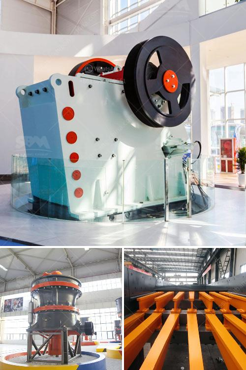

<h3>jaw crusher global machines sweden ab</h3>
Jaw Crusher Global Machines Sweden AB (GM Sweden AB) is a Swedish manufacturer of industrial crushers. They are known for providing high-quality machines that are built to last. Their crusher machines are designed to effectively break down rock, concrete, and other construction materials into smaller pieces for further processing.

The jaw crusher is one of the most popular machines from GM Sweden AB. It is a robust and reliable machine that is suitable for use in various industries, including mining, quarrying, and construction. With a simple design and easy maintenance, the jaw crusher offers excellent productivity and efficiency.

The primary function of the jaw crusher is to reduce the size of large rocks or ore by placing the material between a fixed and moving jaw plate. The moving jaw plate applies force to the rock as it moves downwards, breaking it into smaller pieces. These smaller pieces can then be processed further or used for different applications.

The jaw crusher from GM Sweden AB is known for its high-quality construction and durability. It is built with strong and resistant materials to withstand the toughest working conditions. The crusher is also equipped with heavy-duty components and bearings for improved performance and longevity.

One of the key features of the jaw crusher from GM Sweden AB is its adjustable settings. The machine allows users to easily adjust the gap between the jaws, which determines the size of the crushed material. This flexibility makes it suitable for a wide range of applications, as it can produce different sizes of output material.

In addition to its excellent performance, the jaw crusher from GM Sweden AB also prioritizes operator safety. It is equipped with safety devices that prevent accidental start-ups and ensure the protection of the operator while the machine is in use. The crusher also has a user-friendly control panel that allows operators to easily monitor and control various functions of the machine.

GM Sweden AB is committed to customer satisfaction and providing reliable machines. They offer comprehensive support and after-sales service to ensure that their customers get the most out of their equipment. This includes timely maintenance and repairs, as well as technical assistance and training.

In conclusion, the jaw crusher from GM Sweden AB is a high-quality machine that offers exceptional performance and reliability. It is suitable for various industries and can effectively break down rocks, concrete, and other construction materials. With its adjustable settings and operator-friendly features, it is a versatile and efficient tool for any crushing application. Whether used in mining, quarrying, or construction, the jaw crusher from GM Sweden AB is a reliable choice for high-quality crushing.
<h3>Contact us</h3><ul><li><strong>Whatsapp:&nbsp;<a href="https://wa.me/8613661969651">+8613661969651</a></strong></li><li><a href="https://swt.shibang-china.com/?git&amp;zhl&amp;jaw crusher global machines sweden ab"><strong>Online Service(chat now)</strong></a></li></ul><h3>Related</h3><ul><li><a href='rock crushers in south africa.md'>rock crushers in south africa</a></li><li><a href='jaw crusher vs cone crusher.md'>jaw crusher vs cone crusher</a></li><li><a href='lime production line price.md'>lime production line price</a></li><li><a href='rock crusher saudi arabia.md'>rock crusher saudi arabia</a></li><li><a href='process of making diamonds from coal.md'>process of making diamonds from coal</a></li></ul>