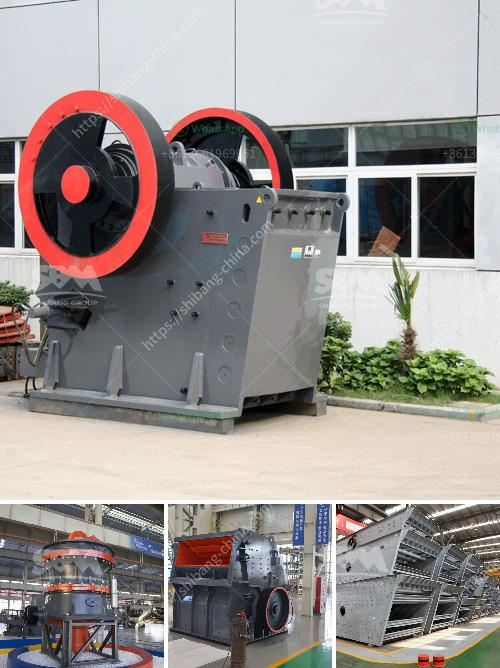

<h3>jaw crusher in bauxite processing plant</h3>
Jaw Crusher in Bauxite Processing Plant: An Essential Piece of Machinery for the Bauxite Mining Process

Bauxite is the primary ore of aluminum. It is formed in weathered volcanic rocks and found in richly forested, humid, tropical climates. Bauxite is the principle source of aluminum life cycle material, and is used in a variety of applications such as building materials, automotive parts, electrical wiring, and packaging. 

To extract aluminum from bauxite, several steps must be taken. One of the key steps in the bauxite mining process is crushing of the ore into smaller manageable sizes. This is achieved by using a jaw crusher, a machine that breaks down bauxite ore into desired sizes. 

The jaw crusher is essential for bauxite processing plants, as it plays a crucial role in efficient ore processing and mine operations. It is designed to reduce the size of large rocks directly into smaller particles, such as gravel, or rock dust. This allows for the efficient extraction of valuable minerals from the bauxite ore. 

The primary function of the jaw crusher is to reduce the size of the ore to a manageable size. It achieves this by using compressive force, where the two jaws of the crusher come together to crush the ore. The size of the final product depends on the gap between the two jaws, which can be adjusted to allow for specific size requirements. 

There are several advantages of using a jaw crusher in bauxite processing plants. Firstly, it is a cost-effective method, as it reduces the need for secondary or tertiary crushers, saving on overall operational costs. Secondly, it is a versatile piece of machinery that can handle a wide range of materials, from soft rocks to hard ores. This makes it suitable for various mining applications. 

Additionally, the jaw crusher is highly efficient, as it can process large amounts of ore in a relatively short time. This increases productivity and reduces downtime, allowing for a continuous supply of bauxite to be processed. It also has a simple and robust design, making it reliable and easy to maintain, further enhancing its efficiency. 

Moreover, the jaw crusher is designed to withstand harsh operating conditions commonly found in mining sites. The machine is built to withstand heavy loads and vibrations, ensuring its durability in demanding environments. It has a rugged construction that can handle the abrasive nature of the bauxite ore without significant wear and tear. 

In conclusion, the jaw crusher is an essential piece of machinery in bauxite processing plants. It plays a vital role in reducing the size of the ore to enable efficient extraction of aluminum. Its cost-effectiveness, versatility, efficiency, and durability make it a valuable asset in the mining industry. By utilizing a jaw crusher, bauxite processing plants can optimize their operations, increase productivity, and maximize their return on investment.
<h3>Contact us</h3><ul><li><strong>Whatsapp:&nbsp;<a href="https://wa.me/8613661969651">+8613661969651</a></strong></li><li><a href="https://swt.shibang-china.com/?git&amp;zhl&amp;jaw crusher in bauxite processing plant"><strong>Online Service(chat now)</strong></a></li></ul><h3>Related</h3><ul><li><a href='zinc ash crusher machine required.md'>zinc ash crusher machine required</a></li><li><a href='philippines crusher equipment.md'>philippines crusher equipment</a></li><li><a href='rock crusher machine.md'>rock crusher machine</a></li><li><a href='iron processing machine.md'>iron processing machine</a></li><li><a href='vermiculite processing equipment.md'>vermiculite processing equipment</a></li></ul>