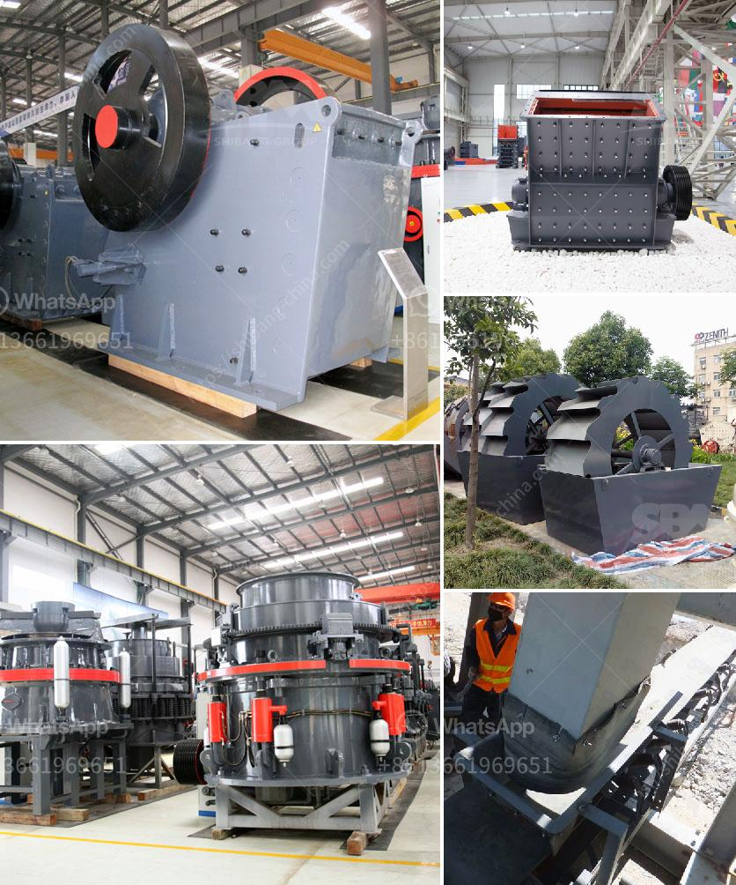

<h3>jaw crusher in south africa</h3>
Jaw Crusher in South Africa: Undoubtedly, South Africa is indisputably one of the most mineral-rich countries in the world, and with the continuous development of technology, the jaw crusher has become one of the most popular equipment in the mining industry. This is primarily due to its significant role in the primary crushing process, as well as its reliability and low maintenance.

The jaw crusher is a versatile piece of machinery that can be used for a wide range of applications, including rock crushing, building materials crushing, and recycling of construction waste. It is designed to crush large rocks into smaller rocks or gravel, allowing for efficient reprocessing of these materials.

One of the key features of the jaw crusher is its ability to handle hard, abrasive materials, such as granite, ores, or recycled concrete. This is made possible by the use of a fixed jaw plate and a moving jaw plate, both of which are constructed with manganese steel. When the material is fed into the chamber, it is crushed between the two jaws, resulting in smaller-sized particles.

In South Africa, there is a growing emphasis on recycling and the use of sustainable materials. The jaw crusher plays a key role in this process, allowing for the efficient recycling of concrete waste into reusable aggregates. These aggregates can then be used in road construction, pavement, and other projects, reducing the need for new materials and minimizing environmental impact.

In addition to its practicality, the jaw crusher is also known for its cost-effectiveness. It is a relatively affordable piece of equipment, requiring low maintenance and offering high productivity. This makes it an attractive option for mining companies and contractors operating in South Africa.

Overall, the jaw crusher is a versatile and efficient piece of equipment that is essential in the mining industry. With its ability to crush hard and abrasive materials and its cost-effectiveness, it has become a popular choice in South Africa. As the country continues to develop and focus on sustainability, the jaw crusher will undoubtedly play a crucial role in the recycling and construction sectors.
<h3>Contact us</h3><ul><li><strong>Whatsapp:&nbsp;<a href="https://wa.me/8613661969651">+8613661969651</a></strong></li><li><a href="https://swt.shibang-china.com/?git&amp;zhl&amp;jaw crusher in south africa"><strong>Online Service(chat now)</strong></a></li></ul><h3>Related</h3><ul><li><a href='gold screening machines south africa.md'>gold screening machines south africa</a></li><li><a href='quarry plant all in one gold mining equipment.md'>quarry plant all in one gold mining equipment</a></li><li><a href='calculation of owning and operating costs of crushers.md'>calculation of owning and operating costs of crushers</a></li><li><a href='500 tph stone crusher price.md'>500 tph stone crusher price</a></li><li><a href='gold crusher plant for sale australia.md'>gold crusher plant for sale australia</a></li></ul>