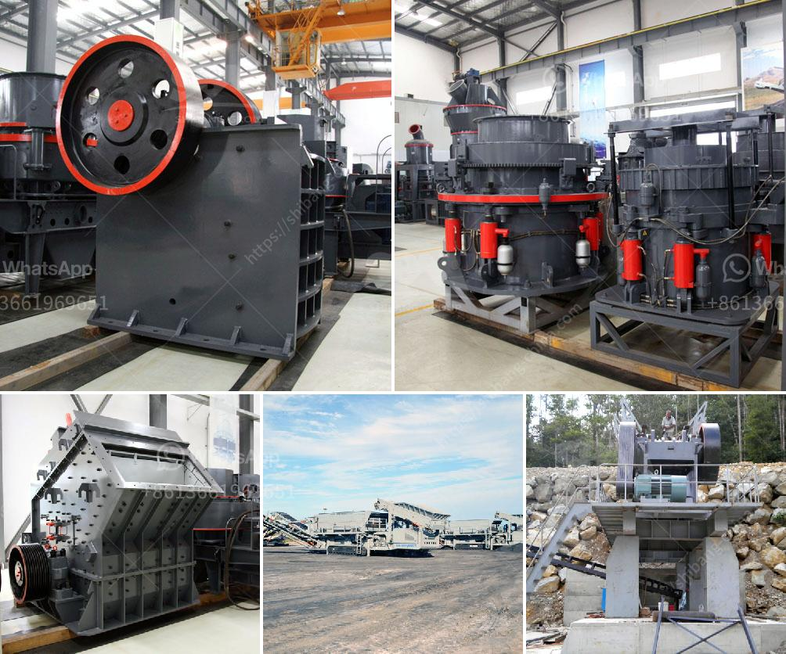

<h3>jaw crusher mobile</h3>
The jaw crusher mobile crushing plant is a popular alternative to traditional stationary crusher plant. It combines the advantages of jaw crushers, impact crushers and cone crushers, as well as screening equipment to make a complete stone crushing plant. It has compact structure, easy to use and maintain, stable performance, low operating cost and high efficiency.

Jaw crusher mobile is mainly used for the crushing of large rocks, broken stones, construction waste, mobile crushing plants can be built around the jaw crusher mobile. This results in easy transportation and reduced hauling costs, especially when processing materials such as construction waste. The mobile jaw crusher plant is able to move freely and is suitable for harsh concrete working conditions.

The mobile jaw crusher is also equipped with a jaw crusher, which is characterized by large crushing ratio and strong crushing capacity. Its high-quality components are used, such as the jaw crusher and the eccentric shaft to ensure the reliability and durability of the equipment.

One of the benefits of the mobile jaw crusher plant is the convenience of being far away from any mining site. On-site mining is a crucial part of mining operations, where it can reduce the resources and time spent on transportation. The mobile jaw crusher can be directly driven to the site, eliminating the need for transportation and saving costs.

The jaw crusher mobile crushing plant has a relatively small area, greatly reducing the initial investment cost, and reducing the construction period and infrastructure investment. It brings a lot of convenience to production sites.

In conclusion, the jaw crusher mobile crushing plant is an excellent choice for flexible crushing operations. It is highly efficient and energy-saving, provides high-quality product output, and is also cost-effective. Whether you need a mobile crusher for construction waste, rock, ore, or concrete recycling, the jaw crusher mobile plant is an ideal choice.
<h3>Contact us</h3><ul><li><strong>Whatsapp:&nbsp;<a href="https://wa.me/8613661969651">+8613661969651</a></strong></li><li><a href="https://swt.shibang-china.com/?git&amp;zhl&amp;jaw crusher mobile"><strong>Online Service(chat now)</strong></a></li></ul><h3>Related</h3><ul><li><a href='gold sand separation equipment philippines.md'>gold sand separation equipment philippines</a></li><li><a href='small scale mining plant layout.md'>small scale mining plant layout</a></li><li><a href='small mobile rock pulverizer.md'>small mobile rock pulverizer</a></li><li><a href='mini cement plants manufacturer africa.md'>mini cement plants manufacturer africa</a></li><li><a href='slag vertical mill.md'>slag vertical mill</a></li></ul>