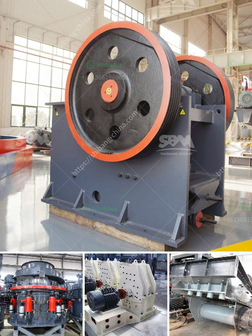

<h3>jaw crusher of zenith</h3>
The jaw crusher from Zenith is designed for the crushing of minerals and rocks with compressive strength up to 320 MPa. By adopting the advanced technology from the world, Zenith jaw crusher has outstanding performance in crushing all kinds of ores and stones, even in the most challenging working conditions.

Zenith jaw crusher is easy to install, operate, and maintain. As per feedback, our experts will make continuous improvements on our products to meet customers' changing needs. It is widely used in fields of mining, metallurgy, construction, smelting, hydropower and chemical industries, etc.

The jaw crusher features a high ratio of crushing, homogeneous final grain size, simple structure, reliable operation, easy maintenance, low operating costs, and high efficiency. In addition, the jaw crusher has large production capacity and low power consumption.

The Zenith jaw crusher is suitable for primary and secondary crushing all kinds of minerals and rocks with compressive strength less than 320 MPa. It is widely used in mining, metallurgical industry, building material, highway, railway, and chemical industry.

With the continuous advancement of technology, Zenith jaw crusher has also undergone various improvements to meet the increasing demands of customers. The deep cavity design and optimized rotation speed ensure high productivity, uniform particle size, and good particle shape. The lubrication system ensures reliable operation and high efficiency.

Overall, the jaw crusher from Zenith is an ideal choice for crushing minerals and rocks with compressive strength up to 320 MPa. It has the advantages of high crushing ratio, large capacity, reliable performance, easy maintenance, and low operating cost. If you are interested in our jaw crusher, please contact us for more information.
<h3>Contact us</h3><ul><li><strong>Whatsapp:&nbsp;<a href="https://wa.me/8613661969651">+8613661969651</a></strong></li><li><a href="https://swt.shibang-china.com/?git&amp;zhl&amp;jaw crusher of zenith"><strong>Online Service(chat now)</strong></a></li></ul><h3>Related</h3><ul><li><a href='feldspar ball mill in kenya.md'>feldspar ball mill in kenya</a></li><li><a href='hot sale and low cost mobile crushing plant.md'>hot sale and low cost mobile crushing plant</a></li><li><a href='complete gold mining equipment for small scale mines.md'>complete gold mining equipment for small scale mines</a></li><li><a href='gypsum manufacturing equipment.md'>gypsum manufacturing equipment</a></li><li><a href='limestone processes of landscape.md'>limestone processes of landscape</a></li></ul>