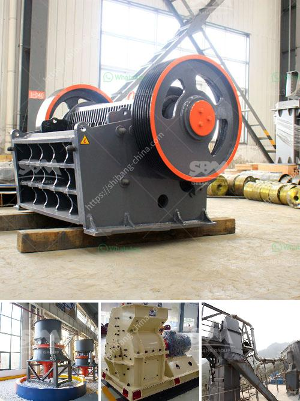

<h3>jaw crusher plates supplier philippines</h3>
A jaw crusher is a mechanical equipment that uses compressive force to break rocks into small pieces. It is a widely used piece of machinery in many industrial sectors, including mining, smelting, building materials, road, railway, water conservancy, chemical industry, and so on. The jaw crusher is known for its high efficiency, durability, and adjustable jaws.

The jaw crusher plates are one of the main components of the jaw crusher machine, which plays an important role in the crushing process. However, they do wear out over time due to constant high-velocity impacts. This makes it necessary to have a reliable jaw crusher plates supplier in the Philippines.

Choosing the right supplier for your jaw crusher plates is crucial since they can directly affect the performance and lifespan of your equipment. In the Philippines, there are several reputable suppliers of jaw crusher plates that you can find online. However, not all of them provide high-quality products.

1. Quality: Look for a supplier that offers durable and high-quality jaw crusher plates. They should be made of high-grade materials that can withstand heavy-duty operations.

2. Pricing: Compare the prices offered by different suppliers and choose the one that offers the best value for your money. However, be cautious of suppliers offering unusually low prices, as it could indicate low-quality products.

3. Reputation: Check the supplier's reputation in the industry. Look for reviews and feedback from previous customers to get an idea of the supplier's reliability and customer satisfaction.

4. Customization: Choose a supplier that can provide customized jaw crusher plates according to your specific requirements. This will ensure a perfect fit and optimal performance.

Overall, finding a reliable jaw crusher plates supplier is essential for maintaining the efficiency and productivity of your jaw crusher. Take the time to research and compare different suppliers to make an informed decision. With the right supplier, you can ensure that your jaw crusher remains in top working condition for a long time, minimizing downtime and maximizing production.
<h3>Contact us</h3><ul><li><strong>Whatsapp:&nbsp;<a href="https://wa.me/8613661969651">+8613661969651</a></strong></li><li><a href="https://swt.shibang-china.com/?git&amp;zhl&amp;jaw crusher plates supplier philippines"><strong>Online Service(chat now)</strong></a></li></ul><h3>Related</h3><ul><li><a href='materials hammer mill.md'>materials hammer mill</a></li><li><a href='cone crusher for salae used.md'>cone crusher for salae used</a></li><li><a href='price of stone crush machine in pakistan.md'>price of stone crush machine in pakistan</a></li><li><a href='grinding balls in tanzania.md'>grinding balls in tanzania</a></li><li><a href='ball mill 800 ton day.md'>ball mill 800 ton day</a></li></ul>