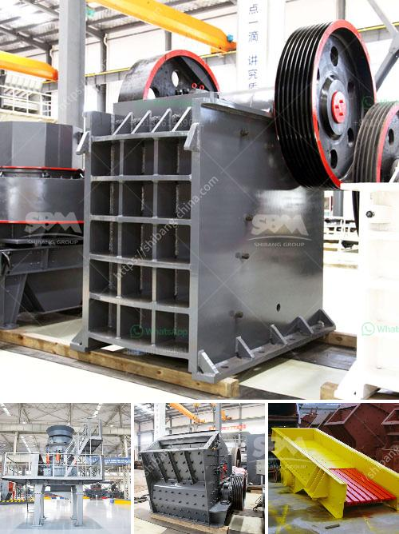

<h3>jaw crusher process description</h3>
A jaw crusher is a primary crusher that breaks down big chunks of rocks into smaller pieces. It is widely used in mining, construction, and recycling industries, and has a high crushing ratio, even with sticky materials.

The jaw crusher consists of two jaws, which are made from heavy-duty manganese steel. They have a fixed jaw and a movable jaw, which is controlled by a toggle plate. The jaws are set at an acute angle to each other, and one jaw is pivoted so that it can swing between the two jaws. As the material enters the jaw crusher, it is crushed between the two jaws, and the crushed material is discharged through the bottom opening.

The jaw crusher process is controlled by the regulation of the gap between the two jaws. As the material passes through the jaws, the size reduction occurs and the material is gradually discharged. This gap can be adjusted using various methods, such as by adjusting the position of the toggle plate or by using a hydraulic system.

In addition to the size reduction, the jaw crusher also provides a uniform size distribution of the crushed material. This is achieved by the continuous compression of the material between the two jaws, which helps to create a more spherical shape.

One of the key advantages of the jaw crusher is its ability to handle a wide range of feed sizes. It can accept boulders as large as 1000mm in diameter, and it can crush them down to a size of 150mm in less than a minute. This makes it ideal for primary crushing applications in mines and quarries.

Overall, the jaw crusher process is straightforward and efficient. It provides a reliable and cost-effective solution for size reduction of various materials. With its high crushing ratio and versatile design, the jaw crusher is a valuable asset for any industrial operation.
<h3>Contact us</h3><ul><li><strong>Whatsapp:&nbsp;<a href="https://wa.me/8613661969651">+8613661969651</a></strong></li><li><a href="https://swt.shibang-china.com/?git&amp;zhl&amp;jaw crusher process description"><strong>Online Service(chat now)</strong></a></li></ul><h3>Related</h3><ul><li><a href='coal crushing equipment.md'>coal crushing equipment</a></li><li><a href='mining equipment used in mining industry.md'>mining equipment used in mining industry</a></li><li><a href='process of mining silica rock crusher.md'>process of mining silica rock crusher</a></li><li><a href='minimum output size in jaw crusher.md'>minimum output size in jaw crusher</a></li><li><a href='stearic acid coating machine for calcium carbonate.md'>stearic acid coating machine for calcium carbonate</a></li></ul>