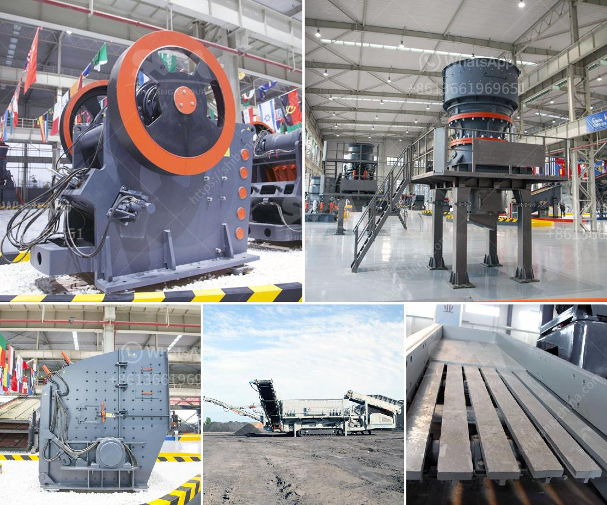

<h3>jaw crusher refurbished</h3>
Mining and construction activities often require a reliable and high-performing crushing machine to maximize productivity and reduce costs. If you are in need of a jaw crusher refurbishment, let us introduce you to the refurbishment process. Refurbishing a jaw crusher not only extends its lifespan but also ensures that it operates at its optimal efficiency.

Why should you consider refurbishing your jaw crusher, and what benefits does it provide? Firstly, a refurbished jaw crusher can save you a significant amount of money. Investing in a new machine can be expensive, while refurbishing an existing crusher is a cost-effective alternative that can result in substantial savings. Secondly, refurbishment enhances the functionality and efficiency of your jaw crusher. Over time, wear and tear can impact the performance of the machine, leading to reduced productivity. Refurbishment renews the critical components, ensuring the crusher functions like new and performs at peak levels.

So, what exactly happens during the refurbishment process of a jaw crusher? Let's take a closer look.

1. Assessment: Before starting the refurbishment, an assessment of the crusher's condition is conducted. This evaluation helps identify the necessary repairs and replacements required to restore the optimal functionality of the machine.

2. Disassembly: The jaw crusher is disassembled, and all the parts are separated. This step allows for a thorough examination of each component and the identification of damaged or worn-out parts.

3. Replacements: Damaged or worn-out parts are replaced with new ones. This includes replacing bearings, jaw dies, toggle seats, springs, and any other components that are critical to the crusher's proper functioning. High-quality and durable parts are used to ensure longevity and performance.

4. Cleaning and Sandblasting: All components are thoroughly cleaned to remove dirt, grease, and any other contaminants that may impact the machine's performance. Sandblasting is also carried out to remove rust and provide a clean surface for further treatment.

5. Reassembly and Testing: After all the necessary replacements and cleaning are completed, the crusher is reassembled. Each part is carefully installed, ensuring it fits perfectly and functions as intended. Once reassembled, the crusher undergoes extensive testing to ensure it operates smoothly and efficiently.

6. Painting and Final Touches: The refurbished jaw crusher receives a fresh coat of paint, giving it a new and aesthetically pleasing appearance. Any final adjustments are made to ensure the crusher is ready to tackle the toughest mining and construction tasks.

By opting for refurbishment instead of purchasing a new crusher, you not only save money but also contribute to more sustainable practices. Refurbishment reduces waste by extending the lifespan of existing equipment. Additionally, refurbishment can be completed in a shorter timeframe compared to the process involved in purchasing and commissioning a new crusher.

In conclusion, the refurbishment of a jaw crusher is a smart investment that offers numerous benefits. From cost savings to improved functionality, refurbishment ensures that your crusher operates at its optimal level, maximizing productivity and minimizing downtime. By choosing to refurbish your jaw crusher, you are not only restoring the performance and efficiency of your machine but also making a sustainable and environmentally conscious choice.
<h3>Contact us</h3><ul><li><strong>Whatsapp:&nbsp;<a href="https://wa.me/8613661969651">+8613661969651</a></strong></li><li><a href="https://swt.shibang-china.com/?git&amp;zhl&amp;jaw crusher refurbished"><strong>Online Service(chat now)</strong></a></li></ul><h3>Related</h3><ul><li><a href='quarry crusher for sale in ghana.md'>quarry crusher for sale in ghana</a></li><li><a href='price of crusher of stone in peru.md'>price of crusher of stone in peru</a></li><li><a href='coal hammer mill capacity power.md'>coal hammer mill capacity power</a></li><li><a href='how much complete cost for iron ore crasher plants setup.md'>how much complete cost for iron ore crasher plants setup</a></li><li><a href='mini rock crushers for sale.md'>mini rock crushers for sale</a></li></ul>