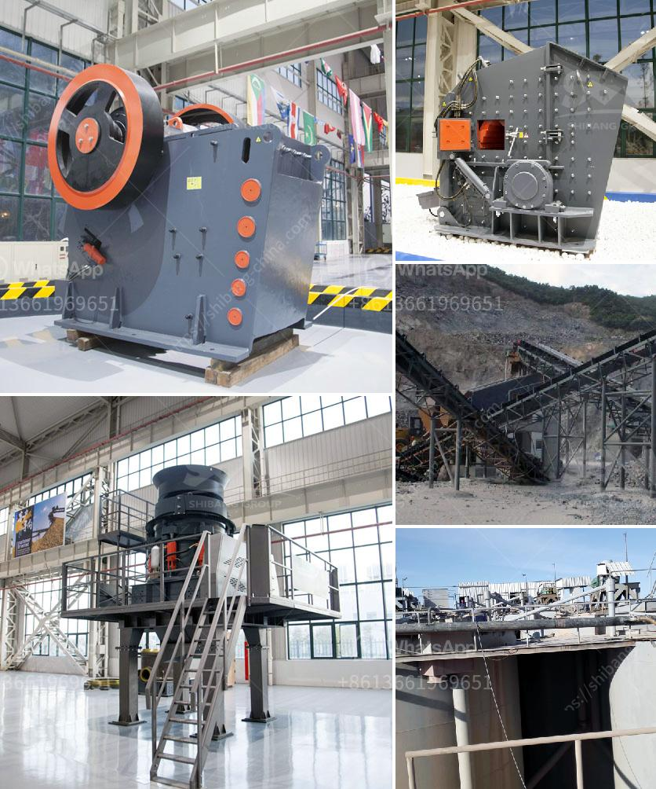

<h3>jaw crusher saudi price</h3>
The Saudi Arabian economy has always been reliant on the oil industry. However, recent efforts to diversify and strengthen other sectors have led to significant growth and investment opportunities in various industries. One such industry is the mining sector, which has seen substantial developments in recent years.

In the mining sector, one essential piece of equipment that plays a vital role is the jaw crusher. A jaw crusher is a machine that is used to crush large stones into smaller stones or gravel, typically used in the construction and building industries. Jaw crushers can reduce the size of materials down to 10-25 cm or even smaller, making them effective at breaking down even the hardest rocks.

With the growth of the mining industry in Saudi Arabia, the demand for jaw crusher has increased significantly. Jaw crusher brings the industry’s latest technology and develops a new concept crusher on the basis of more than 20 years of experience in designing, manufacturing, and supplying jaw crushers. The crusher features large crushing capacity, low energy consumption, reliable performance, and easy maintenance.

When it comes to the price of a jaw crusher, Saudi Arabia has always been a vital factor. In order to offer the best jaw crusher price, each manufacturer understands the value of price concessions and takes action to reduce the cost of production. They are guided by the principle of integrity and customer satisfaction, striving to provide customers with high-quality products at competitive prices.

The price of jaw crushers in Saudi Arabia is relatively low. Compared to other types of construction machinery in the market, jaw crusher prices in Saudi Arabia are lower, so it has become the preferred equipment for crushing stones in the country.

Because the demand for mining and construction materials is increasing, Saudi Arabian companies that supply jaw crushers are growing in number. The factors that affect the price of jaw crusher in Saudi Arabia include the fluctuation of material prices, market demand, and bottlenecks when investing in infrastructure construction. This article mainly introduces the factors that affect the price of jaw crusher and how to improve the efficiency of the equipment.

In conclusion, as the mining industry continues to grow in Saudi Arabia, the demand for jaw crusher is also increasing. With the ongoing development, diversified economy, and expansion of mining projects, jaw crusher price in Saudi Arabia will become an increasingly crucial factor. The article mainly introduces the common faults and troubleshooting methods of the jaw crusher.                                                   Reference:

- https://www.constmachmobilecrushers.com/mobile-jaw-crusher-plant.manufacturer-2019-saudi-arabia-ruz.jpg
<h3>Contact us</h3><ul><li><strong>Whatsapp:&nbsp;<a href="https://wa.me/8613661969651">+8613661969651</a></strong></li><li><a href="https://swt.shibang-china.com/?git&amp;zhl&amp;jaw crusher saudi price"><strong>Online Service(chat now)</strong></a></li></ul><h3>Related</h3><ul><li><a href='iron crusher manufacturer.md'>iron crusher manufacturer</a></li><li><a href='spare parts for raymond mill.md'>spare parts for raymond mill</a></li><li><a href='silica powder making machinery in haiti.md'>silica powder making machinery in haiti</a></li><li><a href='mobile crusher morocco price.md'>mobile crusher morocco price</a></li><li><a href='stone crusher for sale price in dubai.md'>stone crusher for sale price in dubai</a></li></ul>