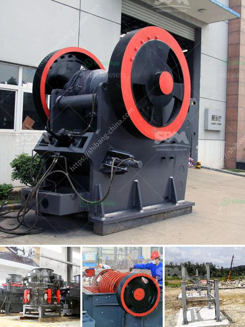

<h3>jaw crusher tanzania</h3>
The jaw crusher is a versatile type of crushing equipment, which is to tear down buildings, demolish concrete, recycle asphalt, and reduce scrap materials into smaller sizes. It is widely used in mining, metallurgy, building materials, highways, railways, water conservancy, chemical industries, and other sectors.

Tanzania is the third largest gold producer in Africa after Ghana and South Africa. So gold mining has enormous profits in Tanzania. Zenith jaw crusher is used in Tanzania mining sector to break and crush the rock ores. Zenith jaw crusher has beenproved to be reliable in mining and construction industries, quarries and civil engineering applications. A jaw crusher is a compression type crusher, comprised of a fixed jaw and moving jaw positioned in a (V). The movable jaw compresses material against the fixed jaw, crushing the material to the desired size. The material exits the jaw through the bottom of the crusher otherwise, known as the discharge opening.

Tanzania’s jaw crushers are increased demand for crushing hard stone. They are cheaper in price compared to other kind of crushers. The morbidity and mortality associated with occupational stone cutting and crushing in Tanzania is noted. They may cause silicosis or tuberculosis due to dust inhalation. The workers at the stone crushing industry in Tanzania have been exposed to high pressure and are experiencing poor health conditions as a result. Locals who have been working in the stone crushing industry in Tanzania for over a decade are suffering from silica dust poisoning. They develop respiratory conditions like asthma and fatal lung diseases.

In conclusion, jaw crushers in Tanzania are quite beneficial for the locals. They are more affordable and self-contained as compared to other crushers in the market. The jaw crushers have been found to be effective and efficient materials handling equipment. Additionally, the jaw crushers are environmentally friendly due to their low noise pollution levels and reduced dust emissions. Nevertheless, measures should be put in place to ensure the safety and well-being of workers in the stone crushing industry, in order to prevent occupational hazards and health risks.
<h3>Contact us</h3><ul><li><strong>Whatsapp:&nbsp;<a href="https://wa.me/8613661969651">+8613661969651</a></strong></li><li><a href="https://swt.shibang-china.com/?git&amp;zhl&amp;jaw crusher tanzania"><strong>Online Service(chat now)</strong></a></li></ul><h3>Related</h3><ul><li><a href='how to make marble powder statues.md'>how to make marble powder statues</a></li><li><a href='automatic stone crusher plant.md'>automatic stone crusher plant</a></li><li><a href='technical specs 400mm x 600mm jaw crusher.md'>technical specs 400mm x 600mm jaw crusher</a></li><li><a href='price conveyor belts.md'>price conveyor belts</a></li><li><a href='stone crushing plant price list.md'>stone crushing plant price list</a></li></ul>