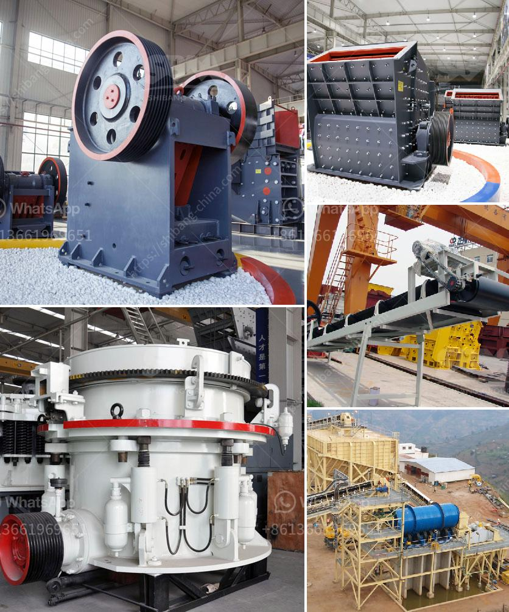

<h3>jaw crusher vs cone crusher</h3>
When it comes to crushing equipment, both jaw crusher and cone crusher are popular choices in the market. This is mainly due to their wide range of applications, which can cater to various crushing needs. Additionally, each type of crusher has their own unique advantages and disadvantages. In this article, we will compare and contrast the two crusher types to help you select the right crushing equipment for your project.

A jaw crusher is a mechanical crushing device that uses compressive force to break particles. This machine features a moving jaw, which creates a conical motion, crushing the materials in a crushing chamber with a long fixed jaw. The output size of the crushed material can be adjusted by changing the gap between the teeth of the jaw crushers.

1. Jaw crushers are able to process a wide range of materials, including abrasive ones and low-strength, brittle ones.

2. They are easy to operate and maintain, making them highly convenient in many crushing applications.

1. Jaw crushers are not suitable for materials with moisture content higher than 15% and compressive strength less than 320 MPa, such as limestone, iron ore, coal, and granite.

Cone crushers are renowned for their ability to crush hard, abrasive ores and rocks. The cone crusher design is similar to the gyratory crusher, but it has less steepness in the crushing chamber and more parallel zone between crushing zones. The cone crusher breaks the materials by squeezing them between an eccentrically gyrating cone and a concave.

2. The size of the feed material can be larger than the cone crusher's output size. This may cause blockage of the crusher.

In conclusion, the jaw crusher and cone crusher both have their own advantages and disadvantages, which should be considered when making a selection. Although they are similar in operation, they have different applications, output sizes, and investment costs. It is important to choose the right crushing equipment based on your specific requirements to achieve the desired crushing capacity and efficiency.

Ultimately, the decision should be made based on the material properties, required crushing capacity, budget, and other factors specific to your project. Consulting with a professional can also help you make an informed decision to ensure the most suitable crushing equipment is chosen for your project's success.
<h3>Contact us</h3><ul><li><strong>Whatsapp:&nbsp;<a href="https://wa.me/8613661969651">+8613661969651</a></strong></li><li><a href="https://swt.shibang-china.com/?git&amp;zhl&amp;jaw crusher vs cone crusher"><strong>Online Service(chat now)</strong></a></li></ul><h3>Related</h3><ul><li><a href='mini rock crushers for sale.md'>mini rock crushers for sale</a></li><li><a href='cost of graphite processing plant.md'>cost of graphite processing plant</a></li><li><a href='roller mill manufacturer.md'>roller mill manufacturer</a></li><li><a href='stone ball mill suppler kenya.md'>stone ball mill suppler kenya</a></li><li><a href='harga mesin pemecah batu merek jepang.md'>harga mesin pemecah batu merek jepang</a></li></ul>