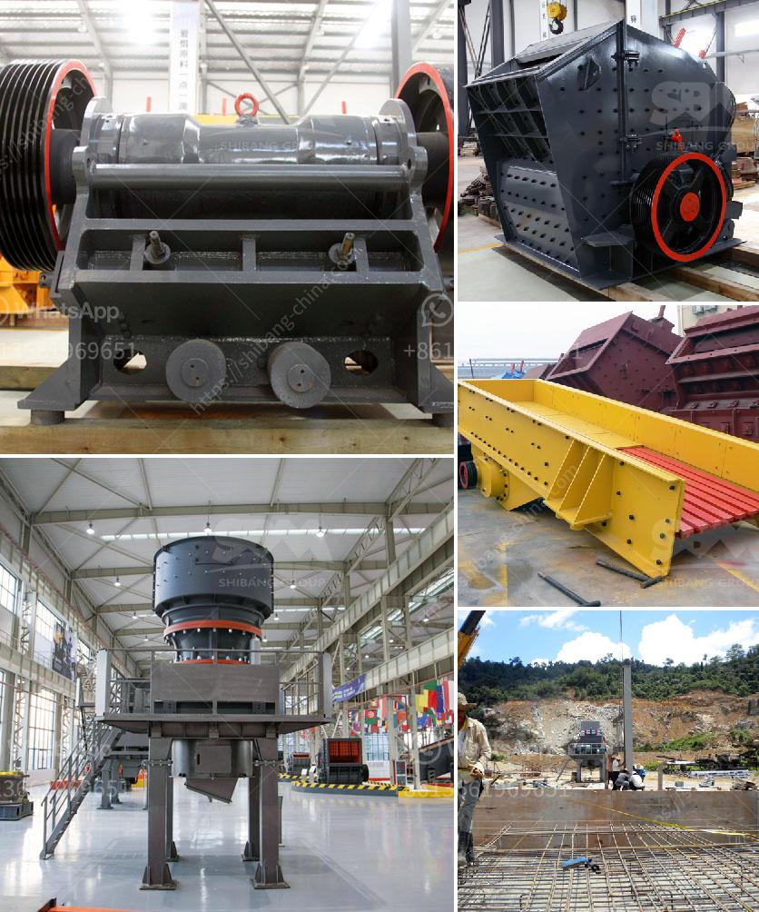

<h3>jaw crushers for sale south africa</h3>
Jaw crushers are becoming increasingly popular in the mining and construction industry in South Africa. It is mainly used in primary crushing process as the name suggests, jaw crushers reduce rock and other materials between a fixed and moving jaw. The moving jaw is mounted on a pitman that has a reciprocating motion, and the fixed jaw stays put. When the material runs between the two jaws, the jaws compress larger boulders into smaller pieces. Jaw crushers can be categorized into two types, namely single toggle jaw crushers and double toggle jaw crushers. Here we will analyze the jaw crushers for sale in South Africa.

According to the type of jaw crusher, jaw crusher can be divided into three kinds, respectively: small Jaw crusher for sale south africa, jaw crusher with large crushing ratio and uniform product size. We use the finite element analysis to increase the radical crushing strength of jaw crusher. Thus, the jaw crusher machine can crush material with strong capacity.

The jaw crusher has a crushing chamber composed by the movable jaw and fixed jaw, simulating animal’s jaw movement to complete crushing operation. It is widely used for medium-grained crushing of various ore and bulk materials in mining, metallurgy, building materials and chemical industry. The maximum compressive strength of the crushed material is 320Mpa.

Jaw crusher is widely used in mining, metallurgy, building materials, highway, railway, water conservancy and chemical and other industries. The new HPC hydraulic cone crusher is the latest crushing technology on the basis of Shanghai SBM, developed a new and efficient cone crusher has the world's advanced level. It is crushing speed, eccentricity (stroke) and high-performance crushing cavity design of the successful combination. It not only improves the production capacity and crushing efficiency but also expanded the scope of application, from limestone to basalt, from stone production to all kinds of ores and broken, efficient in the field of crushing, it is becoming more and more popular in South Africa.

The structures of jaw crusher machine consist of frame, eccentric shaft, large pulley, flywheel, side guard plate, bracket, bracket rear seat, screw, gap adjusting screw, returning spring, fixed jaw plate, and the movable jaw plate. Besides, their working principles are similar to each other. The jaw crusher machine can drive two jaw plates to move simultaneously in the opposite direction.

The motor drives the belt and pulley to make the moveable jaw move through the eccentric shaft. When the moveable jaw plate moves from the fixed jaw plate, the material will be crushed and discharged.

In summary, the choice for a suitable jaw crusher should be based on the specific requirements of the production line and the characteristics of the materials to be crushed. It is recommended to consult with manufacturers or suppliers to ensure that the equipment is suitable for the application. Jaw crushers for sale in South Africa should be small, reliable, with low operating costs and able to provide consistent performance throughout their operation. The application of the jaw crusher machine is wide. Therefore, it can be used in the processing of various industries in South Africa.
<h3>Contact us</h3><ul><li><strong>Whatsapp:&nbsp;<a href="https://wa.me/8613661969651">+8613661969651</a></strong></li><li><a href="https://swt.shibang-china.com/?git&amp;zhl&amp;jaw crushers for sale south africa"><strong>Online Service(chat now)</strong></a></li></ul><h3>Related</h3><ul><li><a href='new gypsum board plant in india.md'>new gypsum board plant in india</a></li><li><a href='used stone crusher mini plant india.md'>used stone crusher mini plant india</a></li><li><a href='quote for china crusher.md'>quote for china crusher</a></li><li><a href='used iron ore impact crusher for hire.md'>used iron ore impact crusher for hire</a></li><li><a href='china ball mill manufacturer.md'>china ball mill manufacturer</a></li></ul>