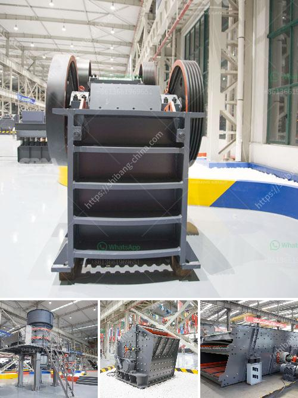

<h3>jaw crushers machine for sale</h3>
Jaw crushers are machines used in the mining and construction industries to crush stones and rocks into smaller pieces. These machines have a number of advantages, such as high crushing ratio, sturdy construction, and reliable performance. The market for jaw crushers is constantly growing, thereby facilitating the availability of these machines on the market.

As the demand for infrastructure projects and residential housing continues to rise, the need for stones and rocks for construction purposes also increases. Jaw crushers play a vital role in this process by crushing the stones into smaller sizes that can be used in various construction applications.

One of the key advantages of jaw crushers is their ability to crush materials of various hardness levels. Whether it is a hard rock or a soft stone, jaw crushers can effectively process such materials with ease. They have a high crushing ratio, meaning that the size of the material is reduced significantly compared to other crushing machines. This translates to reduced energy consumption, as less power is required to crush the same amount of material.

Furthermore, jaw crushers are known for their sturdy construction, which ensures their durability and longevity. They are typically made of high-quality materials, such as cast iron or steel, and are designed to withstand heavy use and extreme conditions. This makes them suitable for use in mining and construction sites, where the machines are subjected to constant wear and tear.

Another advantage of jaw crushers is their reliability. These machines are designed to operate continuously, with minimal downtime or malfunctions. They are equipped with powerful motors and strong crushing chambers that can handle large volumes of material without any issues. This, in turn, increases productivity and efficiency on construction sites, as the crushing process is uninterrupted.

When it comes to purchasing a jaw crusher machine, there are a few factors to consider. Firstly, it is important to choose a reputable manufacturer or supplier that offers high-quality machines. This ensures that the machine will perform optimally and last for a long time. Additionally, it is advisable to choose a machine that suits the specific needs and requirements of the project at hand.

Finally, the cost of the jaw crusher machine is another crucial factor. There are various models and sizes available on the market, each with its own price range. It is important to set a budget and choose a machine that falls within that range. It is also worth considering the long-term costs, such as maintenance, spare parts, and energy consumption, as these can add up over time.

In conclusion, jaw crushers are valuable machines that are widely used in the mining and construction industries. They offer various advantages, such as high crushing ratio, sturdy construction, and reliable performance. As the demand for infrastructure projects increases, so does the need for stones and rocks for construction purposes. Therefore, the market for jaw crushers is thriving, with a wide range of options available for buyers. When purchasing a jaw crusher machine, it is important to consider factors such as quality, suitability, and cost, to ensure the best possible investment.
<h3>Contact us</h3><ul><li><strong>Whatsapp:&nbsp;<a href="https://wa.me/8613661969651">+8613661969651</a></strong></li><li><a href="https://swt.shibang-china.com/?git&amp;zhl&amp;jaw crushers machine for sale"><strong>Online Service(chat now)</strong></a></li></ul><h3>Related</h3><ul><li><a href='stone crusher machine pakistan.md'>stone crusher machine pakistan</a></li><li><a href='chrome lead ore vsi crusher manufacturer.md'>chrome lead ore vsi crusher manufacturer</a></li><li><a href='cone complete crusher plant.md'>cone complete crusher plant</a></li><li><a href='bentonite processing.md'>bentonite processing</a></li><li><a href='used crusher in tanzania.md'>used crusher in tanzania</a></li></ul>