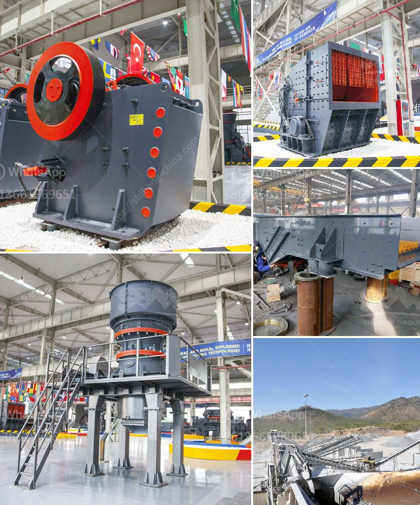

<h3>jaw crushers prices in zimbabwe</h3>
Zimbabwe is an agribusiness country with a vast arable land suitable for various crops. With the country focusing on agriculture, there is a growing need for processing machinery such as jaw crushers. These machines are designed to be robust, durable, and efficient in crushing different types of rocks and minerals.

The prices of jaw crushers in Zimbabwe are influenced by a variety of factors, including capacity, eccentric shaft rotation speed, crushing mode, and the depth of crushing chamber. The number of jaw segments also plays a key role in determining the crusher price. The double-toggle design, which is a common feature of jaw crushers in Zimbabwe, is compression mechanism. It consists of two flywheels of varying sizes and toggle plates. The toggle plates are responsible for transferring the energy generated by the moving jaw towards the fixed one and crush the material in between.

In terms of capacity, most jaw crushers can produce crushing ratios of 6:1 to 8:1, depending on the model. The higher the crushing ratio, the more efficient the machine and the higher the price. However, it is important to choose a jaw crusher with an appropriate capacity for your specific needs. Overloading a crusher can cause premature wear and damage to the machine.

The rotation speed of the eccentric shaft is another crucial factor affecting the price of jaw crushers. The speed determines the amount of energy transferred to the crushing material and the size distribution of the crushed product. Higher rotation speeds result in finer particle sizes, but also increase the risk of wearing out the machine faster. Therefore, higher rotation speed usually comes with a higher price tag.

There are different modes of crushing employed by jaw crushers, namely primary crushing, secondary crushing, and tertiary crushing. The primary crushing mode is the most common and is used to crush large rocks into smaller sizes. Secondary and tertiary crushing modes are used to further reduce the size of the crushed material. The price of a jaw crusher is influenced by the crushing mode it offers, with tertiary crushing models usually being more expensive due to their advanced features.

The depth of the crushing chamber also affects the crusher price. A deep crushing chamber allows for higher crushing ratios and improved efficiency. Additionally, it reduces the risk of material jamming and increases the throughput of the machine. However, a deeper chamber also increases the overall size and weight of the crusher, resulting in a higher price.

In conclusion, the prices of jaw crushers in Zimbabwe are influenced by various factors, including capacity, eccentric shaft rotation speed, crushing mode, and the depth of the crushing chamber. It is essential to assess your specific needs and consider these factors when choosing a jaw crusher to ensure you get the right machine at the right price. Investing in a quality jaw crusher in Zimbabwe will contribute to increased productivity and efficiency in crushing operations, ultimately leading to higher yields in agriculture and other industries.
<h3>Contact us</h3><ul><li><strong>Whatsapp:&nbsp;<a href="https://wa.me/8613661969651">+8613661969651</a></strong></li><li><a href="https://swt.shibang-china.com/?git&amp;zhl&amp;jaw crushers prices in zimbabwe"><strong>Online Service(chat now)</strong></a></li></ul><h3>Related</h3><ul><li><a href='portable jaw crushers.md'>portable jaw crushers</a></li><li><a href='conveyor belt kazakhstan.md'>conveyor belt kazakhstan</a></li><li><a href='feldspar crusher cost.md'>feldspar crusher cost</a></li><li><a href='silica powder making machinery in haiti.md'>silica powder making machinery in haiti</a></li><li><a href='granite crusher price in nigeria.md'>granite crusher price in nigeria</a></li></ul>