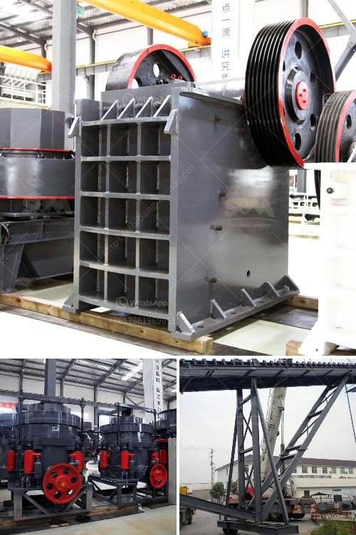

<h3>jaw crusser indonesia</h3>
In today's world, technology is advancing at such a rapid pace that it may be difficult for investors to keep up with the latest trends. One industry that has seen significant changes in recent years is the mining industry. With the increasing demand for minerals and metals, mining companies are constantly on the lookout for efficient and reliable equipment to enhance their productivity.

One such equipment that has gained immense popularity in the mining industry is the jaw crusher. A jaw crusher is a heavy-duty machine that breaks down hard materials into smaller pieces, thereby making the extraction of minerals or metals easier and more efficient. It is widely used in mining, metallurgy, building materials, road, railway, water conservancy, and chemical industries.

Indonesia has a wealth of mineral resources, including coal, copper, gold, natural gas, nickel, and tin. However, Indonesia's mining industry is still underdeveloped, and the country is not known for its efficient mining practices or high-quality mining equipment. This is where the jaw crusher Indonesia comes into play.

The jaw crusher Indonesia is made from high-quality materials to ensure durability and long-lasting performance. Efficiency and reliability are attributes that are inherent in every jaw crusher Indonesia, making them suitable for mining applications.

The design of the jaw crusher Indonesia relies on the interaction between two jaws, one fixed and one moving, to achieve breaking and discharging minerals or metals. This interaction results in a continuous crushing process, reducing the size of the rocks fed into the machine.

One of the advantages of using a jaw crusher Indonesia is its ability to handle a wide range of materials, making it ideal for various mining applications. It can crush materials with a compressive strength of up to 320 MPa, which is quite impressive. The jaw crusher Indonesia can efficiently process materials such as limestone, granite, basalt, and iron ore, to name a few.

Furthermore, the jaw crusher Indonesia is easy to operate and maintain, which adds to its appeal in the mining industry. Maintenance for this machine is straightforward, as it requires minimal lubrication and regular inspection of its components.

Another noteworthy feature of the jaw crusher Indonesia is its affordability. With its cost-effective price range, it offers great value for money, making it an attractive choice for mining companies looking to upgrade their equipment.

In conclusion, the jaw crusher Indonesia has become an essential addition to the mining industry. With its efficient and reliable performance, it ensures the extraction of minerals or metals is done with ease. Additionally, its ability to handle a wide range of materials, ease of operation, and low maintenance requirements make it a desirable option for mining companies in Indonesia. As the demand for minerals and metals continues to rise, it is crucial for mining companies to invest in advanced equipment like the jaw crusher Indonesia to stay competitive and maximize their productivity.
<h3>Contact us</h3><ul><li><strong>Whatsapp:&nbsp;<a href="https://wa.me/8613661969651">+8613661969651</a></strong></li><li><a href="https://swt.shibang-china.com/?git&amp;zhl&amp;jaw crusser indonesia"><strong>Online Service(chat now)</strong></a></li></ul><h3>Related</h3><ul><li><a href='gold ore hammer mills prices mining supplies in zimbabwe.md'>gold ore hammer mills prices mining supplies in zimbabwe</a></li><li><a href='difference between ball mill and roller mill.md'>difference between ball mill and roller mill</a></li><li><a href='calcite micron powder grinding machine in thailand.md'>calcite micron powder grinding machine in thailand</a></li><li><a href='small ore grinding mill with 50 tpd for sale.md'>small ore grinding mill with 50 tpd for sale</a></li><li><a href='small mobile rock pulverizer.md'>small mobile rock pulverizer</a></li></ul>