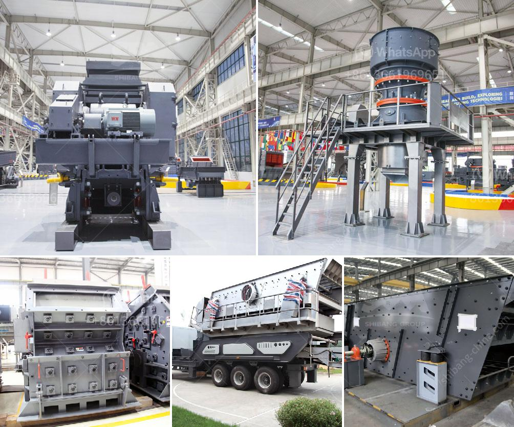

<h3>jaw rock crusher for sale</h3>
Jaw rock crusher for sale is more commonly known as a jaw crusher, which is an essential piece of equipment in the mining and construction industries. These machines are used to crush raw materials like rocks and concrete, into more manageable sizes for various applications. These machines are popular among contractors due to their efficiency, portability, and affordability.

One of the key advantages of a jaw rock crusher for sale is its affordability. When compared to commercial crushers, a jaw crusher offers a significant saving in cost. Each jaw crusher offers a broad range of capabilities and efficiency for reducing the size of materials. Due to its ability to crush tough and abrasive materials, jaw crushers are installed in many industries, including construction and mining.

The jaw rock crusher can be fitted with an electric motor, gas engine, diesel engine, or no engine, depending on the desired application. In some cases, the jaw crushers are used to produce final end product but in most cases, they are employed for primary crushing stages. Jaw crushers are also the preferred choice for harder materials, such as basalt, granite, and quartz.

A jaw crusher operates by pressing a rock or stone, thereby breaking it into a smaller unit of required size. Jaw rock crushers are capable of working with the mobile crushing circuit, underground crushing because of their mobility. They are versatile and are capable of handling a wide range of materials.

Overall, a jaw rock crusher for sale is a great investment and it can help you process rock raw materials into high-quality aggregates in a short time. You should also consider the reputation of the manufacturer and the size and model of the machine before making your decision. After all, a jaw crusher is only as good as its ability to crush rocks.
<h3>Contact us</h3><ul><li><strong>Whatsapp:&nbsp;<a href="https://wa.me/8613661969651">+8613661969651</a></strong></li><li><a href="https://swt.shibang-china.com/?git&amp;zhl&amp;jaw rock crusher for sale"><strong>Online Service(chat now)</strong></a></li></ul><h3>Related</h3><ul><li><a href='prices for cement processing machines.md'>prices for cement processing machines</a></li><li><a href='coal mill price 5 tph.md'>coal mill price 5 tph</a></li><li><a href='micro mill grinding mills.md'>micro mill grinding mills</a></li><li><a href='marble crusher machinery manufacturer.md'>marble crusher machinery manufacturer</a></li><li><a href='second hand german jaw crusher for sale.md'>second hand german jaw crusher for sale</a></li></ul>