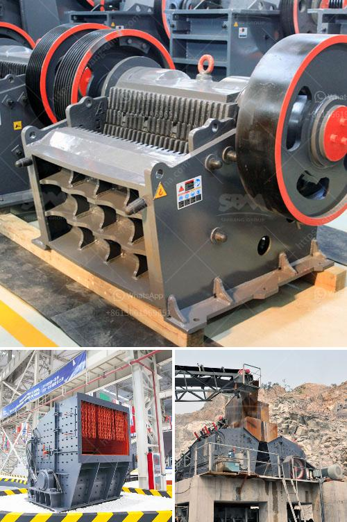

<h3>jaw roll crusher</h3>
The jaw roll crusher has been widely used in industries such as mining, building materials, metallurgy, paving and mining. This machine is commonly used in mines due to its ability to crush tough and abrasive materials. In the jaw roll crusher, one jaw is fixed while the other moves back and forth to crush rocks and minerals.

The movement of the moving jaw against the fixed jaw creates compressive force, which fractures the rocks into smaller pieces. This crushing action is achieved by the vertical and horizontal movement of the two jaws. The vertical movement creates the compressive force, while the horizontal movement allows for efficient feeding and discharge of the crushed material. This design allows for a high reduction ratio and the production of uniform-sized particles.

One of the main advantages of the jaw roll crusher is its simplicity in design and operation. It is easy to maintain and does not require a lot of technical expertise to operate. Additionally, the machine is versatile and can be used for a wide range of applications. It can handle different types of materials, including hard rocks, ores, and minerals.

Another advantage of the jaw roll crusher is its efficiency in crushing large-sized materials. The machine can handle larger feed sizes compared to other types of crushers. This means that more material can be processed in a single pass, resulting in increased productivity.

In conclusion, the jaw roll crusher is a versatile and efficient machine that offers a high reduction ratio and the ability to crush tough and abrasive materials. Its simplicity in design and operation makes it an attractive option for many industries. Whether used in mining, building materials, metallurgy, or paving, this machine is sure to deliver reliable crushing performance.
<h3>Contact us</h3><ul><li><strong>Whatsapp:&nbsp;<a href="https://wa.me/8613661969651">+8613661969651</a></strong></li><li><a href="https://swt.shibang-china.com/?git&amp;zhl&amp;jaw roll crusher"><strong>Online Service(chat now)</strong></a></li></ul><h3>Related</h3><ul><li><a href='nepal crushing crusher.md'>nepal crushing crusher</a></li><li><a href='cement clinker grinding ball mill manufacturer india.md'>cement clinker grinding ball mill manufacturer india</a></li><li><a href='sri lanka sand washing machine prices.md'>sri lanka sand washing machine prices</a></li><li><a href='stone crusher in inda or parkistan.md'>stone crusher in inda or parkistan</a></li><li><a href='talc commodity processing facility companies.md'>talc commodity processing facility companies</a></li></ul>