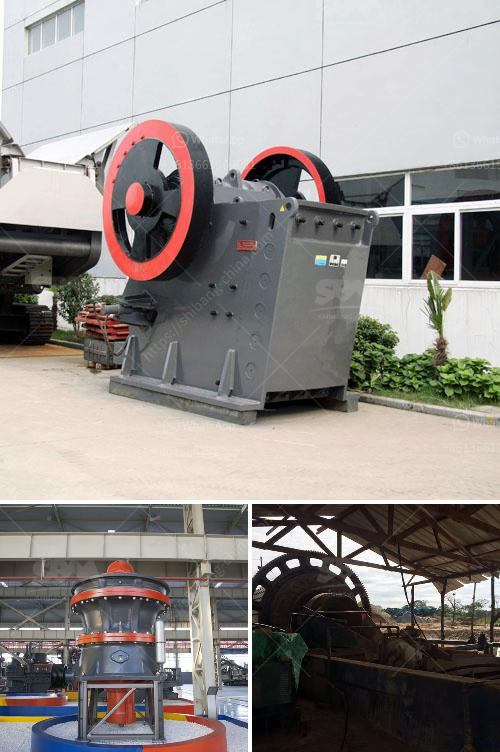

<h3>jual raymond mill bekas</h3>
If you are a business owner in the mining industry, jual Raymond mill bekas could be a great option to consider. Raymond mill is an energy-efficient and highly versatile grinding equipment that is widely used in various industries. It is designed and developed to grind materials into fine powder with the least energy consumption. 

One of the significant advantages of jual Raymond mill bekas is its high capacity. It can process a wide range of materials with various moisture levels, hardness, and sizes. Whether you need to grind limestone, feldspar, dolomite, or any other mineral, this grinding mill can handle it all. Its robust design ensures durability and long-term reliability, making it a worthwhile investment for any business.

Another impressive feature of Raymond mill is its adjustable grinding fineness. With its unique design, you can optimize the process to achieve the desired particle size. This level of control allows you to produce the exact specifications required for your applications. 

Furthermore, jual Raymond mill bekas offers a user-friendly operation system. Its advanced control system and automated features make it easy to operate, even for inexperienced workers. Additionally, it requires minimal maintenance, reducing downtime and maximizing productivity for your business.

Investing in jual Raymond mill bekas also has environmental benefits. Its energy-efficient design reduces the carbon footprint of your operation and helps meet sustainability goals. It consumes less power compared to traditional grinding mills, resulting in significant cost savings on your electricity bills.

In conclusion, jual Raymond mill bekas is an excellent choice for businesses operating in the mining industry. With its high capacity, adjustable grinding fineness, user-friendly operation, and energy efficiency, it offers a range of benefits that can enhance your productivity and profitability. Consider adding jual Raymond mill bekas to your equipment fleet to ensure a competitive edge in the market.
<h3>Contact us</h3><ul><li><strong>Whatsapp:&nbsp;<a href="https://wa.me/8613661969651">+8613661969651</a></strong></li><li><a href="https://swt.shibang-china.com/?git&amp;zhl&amp;jual raymond mill bekas"><strong>Online Service(chat now)</strong></a></li></ul><h3>Related</h3><ul><li><a href='used gold crushing for sale in uae.md'>used gold crushing for sale in uae</a></li><li><a href='mining mobile crusher and washing lebanon.md'>mining mobile crusher and washing lebanon</a></li><li><a href='used iron ore impact crusher for hire.md'>used iron ore impact crusher for hire</a></li><li><a href='crusher plant for sale pakistan.md'>crusher plant for sale pakistan</a></li><li><a href='bentonite clay crusher for sale.md'>bentonite clay crusher for sale</a></li></ul>