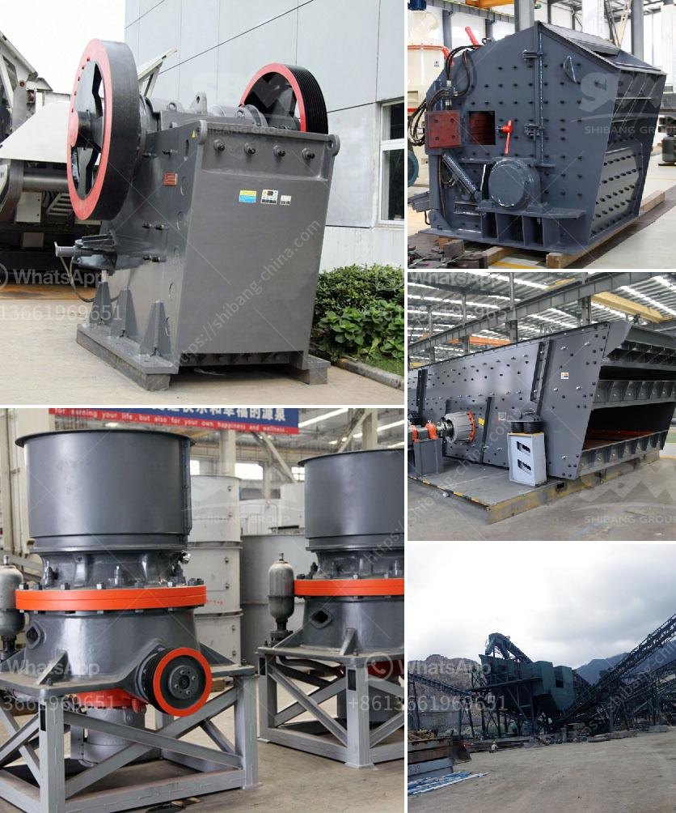

<h3>kaolin mining crusher process</h3>
Kaolin, also known as China clay, is a white, soft, and plastic clay mineral that is mainly composed of kaolinite, a hydrated aluminum silicate mineral. It is a natural resource that is found in large quantities around the world, making it one of the most common minerals on Earth. Kaolin is used in a wide range of industries, including ceramics, paper, rubber, cosmetics, and pharmaceuticals.

The process of extracting kaolin begins with geologists identifying an area with potential kaolin deposits and conducting extensive drilling surveys to obtain samples. Once the kaolin ore is extracted from the earth's crust, it is transported to a processing plant, where it is crushed using various crushers, including jaw crusher, impact crusher, cone crusher, and roller crusher.

The crushed ore is then ground into a fine powder through multiple stages of grinding and milling. Air classifiers are used to separate the ground kaolin particles based on their size and shape. The smaller, finer particles are collected as products, while the larger, coarser particles are returned to the crushers for further grinding.

After the grinding process, the kaolin slurry is subjected to various beneficiation techniques, such as magnetic separation, flotation, and bleaching, to improve its whiteness and remove impurities. These techniques involve the use of chemicals and additional processing steps to achieve the desired quality and purity of the kaolin product.

Once the beneficiation process is complete, the kaolin is de-watered and dried using rotary dryers or calciners. This step removes any remaining moisture and transforms the raw kaolin into a dry and free-flowing powder. The dried kaolin is then transported to storage or shipped to customers for further processing or use in end products.

The mining and processing of kaolin involve a variety of stages, including mining, hauling, crushing, milling, and drying. Each stage requires different equipment to ensure efficient and cost-effective operations. This includes crushers for crushing large rocks into smaller particles, grinding mills for reducing the particle size of the crushed material, classifiers for separating ground kaolin particles, and drying equipment for removing moisture from the kaolin.

In conclusion, the process of mining and processing kaolin is a complex and intricate process that involves the use of a variety of equipment. Crushers are an important part of the mining process as they break down large rocks into smaller, more manageable sizes. The kaolin processing plant uses different types of crushers and equipment to achieve the desired size and quality of the final product.
<h3>Contact us</h3><ul><li><strong>Whatsapp:&nbsp;<a href="https://wa.me/8613661969651">+8613661969651</a></strong></li><li><a href="https://swt.shibang-china.com/?git&amp;zhl&amp;kaolin mining crusher process"><strong>Online Service(chat now)</strong></a></li></ul><h3>Related</h3><ul><li><a href='aggregate quarries crusher in thailand.md'>aggregate quarries crusher in thailand</a></li><li><a href='low cost jaw crusher price.md'>low cost jaw crusher price</a></li><li><a href='marble paving making machinry price.md'>marble paving making machinry price</a></li><li><a href='ball mill calcium.md'>ball mill calcium</a></li><li><a href='used hammer mill crusher.md'>used hammer mill crusher</a></li></ul>