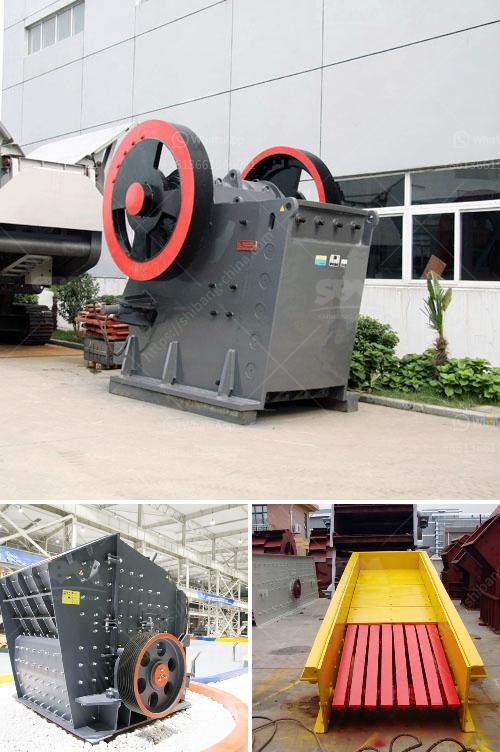

<h3>kaolin powder machine</h3>
Kaolin, also known as china clay, is a naturally occurring clay mineral that is found in abundance in many regions around the world. Its fine particle size and excellent plasticity make it an ideal material for use in various industries such as ceramics, paper, rubber, and cosmetics.

With the increasing demand for kaolin in different applications, the need for efficient and reliable processing equipment has also grown. This is where the kaolin powder machine comes into play. Designed specifically for grinding and processing of kaolin, these machines are capable of producing fine particles with a narrow particle size distribution, making them highly sought after in the kaolin industry.

One of the key components of a kaolin powder machine is the grinding mill. The grinding mill is responsible for breaking down the kaolin clay into fine particles for further processing. It utilizes energy-efficient motors and advanced grinding technology to achieve the desired particle size. The grinding mill also features a sophisticated control system, allowing operators to adjust various parameters and optimize the grinding process.

Another important component of the kaolin powder machine is the classifier. The classifier is responsible for separating the fine particles from the coarse ones. It utilizes centrifugal force and air flow to achieve precise particle classification. The use of a high-efficiency classifier ensures that only fine particles are collected, while the coarse ones are recirculated back to the grinding mill for further grinding.

In addition to grinding and classification, the kaolin powder machine may also include other equipment such as a dryer or a bagging machine. The dryer is used to remove any moisture from the kaolin powder, while the bagging machine is used to package the final product for shipment or storage. These additional components enhance the overall efficiency of the kaolin processing plant.

The kaolin powder machine is not only efficient but also environmentally friendly. It is designed to minimize energy consumption and reduce emissions. The machines are equipped with dust collection systems to prevent the release of fine particles into the atmosphere. They also incorporate noise reduction measures to minimize noise pollution in the surrounding area.

In conclusion, the kaolin powder machine plays a crucial role in the processing of kaolin clay. Its advanced grinding and classification technology enable the production of fine particles with a narrow particle size distribution. The machine is efficient, reliable, and environmentally friendly, making it a valuable asset in the kaolin industry. As the demand for kaolin continues to grow, the need for efficient processing equipment like the kaolin powder machine will also increase.
<h3>Contact us</h3><ul><li><strong>Whatsapp:&nbsp;<a href="https://wa.me/8613661969651">+8613661969651</a></strong></li><li><a href="https://swt.shibang-china.com/?git&amp;zhl&amp;kaolin powder machine"><strong>Online Service(chat now)</strong></a></li></ul><h3>Related</h3><ul><li><a href='mobile crushers hire south africa.md'>mobile crushers hire south africa</a></li><li><a href='quarry making machine from south africa.md'>quarry making machine from south africa</a></li><li><a href='barytes processing equipment.md'>barytes processing equipment</a></li><li><a href='calcium carbonate machine.md'>calcium carbonate machine</a></li><li><a href='milling equipment ball mill.md'>milling equipment ball mill</a></li></ul>