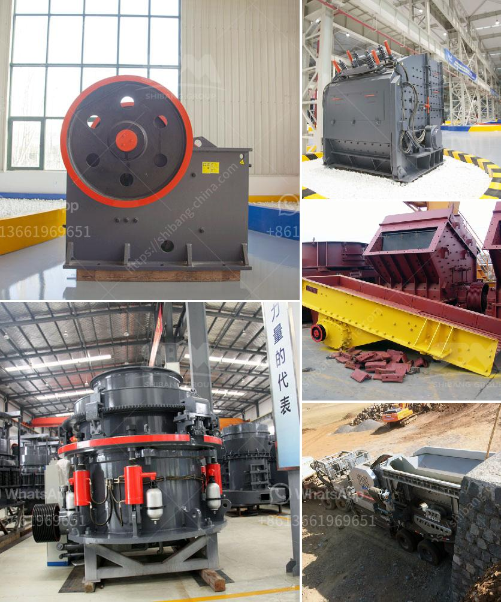

<h3>kenya jaw crushers south africa</h3>
For decades, Kenya has been a major producer and exporter of various agricultural products, such as tea, coffee, and flowers. However, in recent years, the country's mining sector has shown immense potential for growth. One of the key players in this sector is the stone crushing industry, which has seen tremendous development due to the increasing demand for construction materials.

In Kenya, jaw crushers are commonly used as primary crushers for crushing quarry rocks or hard stones. These devices are used to reduce the size of the rocks into smaller, more manageable sizes, ensuring that they can be used for various construction purposes. With the rapid urbanization and infrastructure development happening in Kenya, the demand for crushed stones has surged, making jaw crushers a crucial equipment in this sector.

South Africa, a country renowned for its mining industry, has also experienced an upsurge in demand for jaw crushers. The country is rich in mineral resources, making it a hub for mining activities. The application of jaw crushers in South Africa's mining sector has been significant, contributing to the overall growth of the country's economy.

One of the reasons why jaw crushers are popular in both Kenya and South Africa is their versatility. These crushers can be used for a wide range of materials, from soft rocks to hard stones, making them suitable for various applications. Additionally, their simple design and ease of operation make them highly efficient and effective in the crushing process. This has led to their widespread use in both countries.

Moreover, the availability of jaw crushers in Kenya and South Africa is quite extensive. Numerous manufacturers and suppliers offer a wide range of jaw crushers to cater to the growing demand. This competitive market has led to the innovation of jaw crushers with improved features, such as higher crushing capacities, enhanced durability, and reduced maintenance requirements.

In conclusion, the emergence and growth of the stone crushing industry in Kenya and South Africa have placed jaw crushers at the forefront of the mining sector. Their ability to process various materials and their extensive availability make them invaluable equipment for construction and mining purposes. As both countries continue to invest in infrastructure and mining projects, the demand for jaw crushers is only expected to increase, further boosting their significance in these regions.
<h3>Contact us</h3><ul><li><strong>Whatsapp:&nbsp;<a href="https://wa.me/8613661969651">+8613661969651</a></strong></li><li><a href="https://swt.shibang-china.com/?git&amp;zhl&amp;kenya jaw crushers south africa"><strong>Online Service(chat now)</strong></a></li></ul><h3>Related</h3><ul><li><a href='sand crusher price.md'>sand crusher price</a></li><li><a href='ball mill manufacturer for slag crushing.md'>ball mill manufacturer for slag crushing</a></li><li><a href='cement cement grinding ball mill.md'>cement cement grinding ball mill</a></li><li><a href='gypsum manufacturing equipment.md'>gypsum manufacturing equipment</a></li><li><a href='best machine for coal grinding.md'>best machine for coal grinding</a></li></ul>