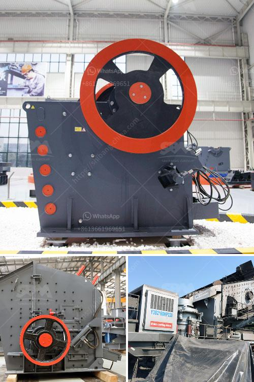

<h3>kobe vertical mill for slag grinding</h3>
With the introduction of Kobe vertical roller mills for slag grinding, cement plants have successfully been able to reproduce the previously unattainable product qualities, such as high fineness of the particles in a significantly reduced time frame. Extremely efficient and flexible, this groundbreaking technology has facilitated the optimization of cement production processes, leading to a substantial increase in productivity, while simultaneously enhancing environmental sustainability.

Utilizing advanced grinding technology, the Kobe vertical mill for slag grinding is efficient, reliable, and has a minimal environmental impact. The mill is able to grind slag with a feed size of up to 20mm and produce a product with a fineness of 5500cm²/g, accounting for the beneficial aspects of slag as a supplementary cementitious material. Moreover, through careful control of the grinding process, the mill can produce cement with desired characteristics, such as improved setting time and enhanced strength development.

One of the key advantages of the Kobe vertical mill is its ability to blend different slag compositions, allowing cement plants to utilize a wide range of industrial by-products. This not only reduces the reliance on virgin raw materials but also helps in waste reduction and the sustainable use of resources. By incorporating slag from various sources, the cement industry can contribute to a circular economy model, turning waste into a valuable resource.

In addition to its technological advancements, the Kobe vertical mill ensures operational convenience and reliability. Its fully automated system, integrated with advanced control mechanisms, allows for optimized performance and consistent product quality. The mill also has a compact design, occupying less floor space, making it ideal for retrofitting in existing plants or establishing new grinding units.

As the cement industry continues its journey towards sustainability, the Kobe vertical mill for slag grinding offers a promising solution. With its ability to reduce CO2 emissions, improve product quality, and optimize production processes, this cutting-edge technology is revolutionizing an essential aspect of cement manufacturing. Embracing this technology can prove to be a game-changer for cement plants worldwide, enabling them to achieve high-quality cement production while minimizing environmental impact.
<h3>Contact us</h3><ul><li><strong>Whatsapp:&nbsp;<a href="https://wa.me/8613661969651">+8613661969651</a></strong></li><li><a href="https://swt.shibang-china.com/?git&amp;zhl&amp;kobe vertical mill for slag grinding"><strong>Online Service(chat now)</strong></a></li></ul><h3>Related</h3><ul><li><a href='small stone brick crusher.md'>small stone brick crusher</a></li><li><a href='mineral grinding mill.md'>mineral grinding mill</a></li><li><a href='used stone crusher in ontario.md'>used stone crusher in ontario</a></li><li><a href='process of mining silica rock crusher.md'>process of mining silica rock crusher</a></li><li><a href='small mobile wash plants for sale.md'>small mobile wash plants for sale</a></li></ul>