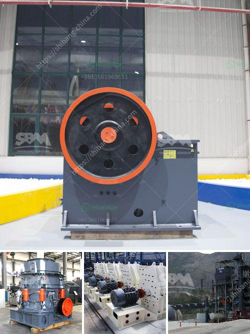

<h3>komatsu crusher in japan for sale</h3>
When it comes to finding a reliable and durable crusher machine, Komatsu is undoubtedly the top brand in the market. With its innovative and advanced technology, Komatsu has been providing cutting-edge equipment for construction, mining, and quarry industries for several decades. Japan, being the birthplace of this world-renowned brand, has a wide range of Komatsu crushers available for sale. In this article, we will shed light on the Komatsu crusher in Japan for sale, its amazing features, and the benefits it offers.

One of the key advantages of opting for a Komatsu crusher is its superior efficiency and productivity. These machines are designed to crush large rocks, minerals, and ore materials into smaller and more manageable sizes. With their powerful engines and robust construction, Komatsu crushers can effortlessly handle even the toughest materials. This ensures that you can complete your projects efficiently without any delays.

Komatsu crushers are known for their high performance and low maintenance requirements. This saves both time and money for the operators. Equipped with cutting-edge technology, these crushers are engineered to offer precise and consistent results. The advanced control systems and automated features make them easy to operate, allowing even novice users to handle them effectively.

Safety is also a major concern in any job site, and Komatsu doesn't disappoint in this aspect. These crushers come with multiple safety features to ensure the well-being of the operators. From designed-in guards to emergency shutdown systems, Komatsu takes the safety of its users seriously.

When it comes to buying a Komatsu crusher in Japan, the options are vast. From jaw crushers to cone crushers, Komatsu offers a wide range of models to suit different applications and budgets. Each model is designed to cater to specific needs, providing flexibility and versatility to the users.

Komatsu crushers are also highly durable, making them a cost-effective investment in the long run. The robust construction and high-quality materials used in their manufacturing ensure that they can withstand the harshest of conditions and work seamlessly for extended periods. This reduces the need for frequent repairs and replacements, hence reducing maintenance costs and increasing profitability.

In addition to superior performance and durability, Komatsu crushers are also known for their excellent aftermarket support. Komatsu has a widespread network of service centers and authorized dealers in Japan and around the world. This ensures that the owners of Komatsu crushers can access genuine spare parts, technical assistance, and regular maintenance services easily.

In conclusion, if you are in the market for a crusher in Japan, opting for a Komatsu crusher is a smart choice. These machines offer exceptional performance, durability, and safety, making them perfect for various industries. With their advanced features, ease of operation, and excellent aftermarket support, Komatsu crushers are worth every penny. Don't miss the opportunity to invest in this incredible brand and enjoy hassle-free crushing operations for years to come.
<h3>Contact us</h3><ul><li><strong>Whatsapp:&nbsp;<a href="https://wa.me/8613661969651">+8613661969651</a></strong></li><li><a href="https://swt.shibang-china.com/?git&amp;zhl&amp;komatsu crusher in japan for sale"><strong>Online Service(chat now)</strong></a></li></ul><h3>Related</h3><ul><li><a href='small portable rock crushers for sale africa.md'>small portable rock crushers for sale africa</a></li><li><a href='mini cement plants manufacturer africa.md'>mini cement plants manufacturer africa</a></li><li><a href='conveyor belt equipment for mining south africa.md'>conveyor belt equipment for mining south africa</a></li><li><a href='ore beneficiation equipment suppliers china.md'>ore beneficiation equipment suppliers china</a></li><li><a href='ball mill capacity how to calculate.md'>ball mill capacity how to calculate</a></li></ul>